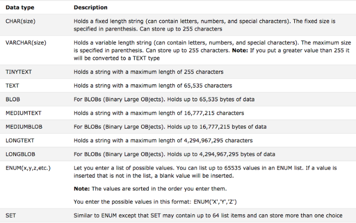
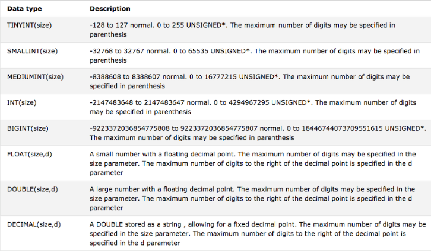
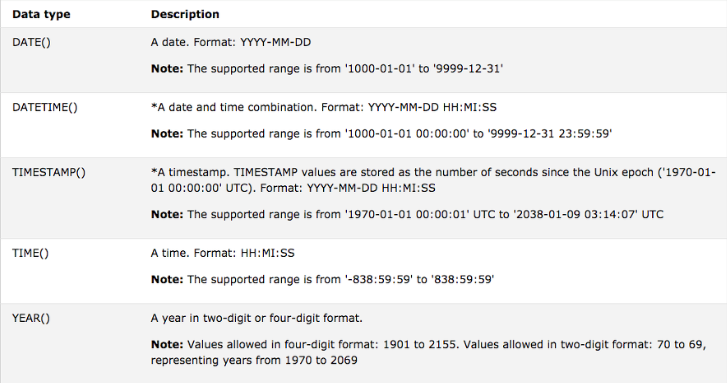

### 목차

---
# 데이터베이스
## 데이터베이스 생성하기
```sql
CREATE DATABASE 데이터베이스이름;
```

<br>

ex) `TODO`라는 이름의 데이터베이스를 생성하는 예제
```SQL
CREATE DATABASE TODO;
```

## 데이터베이스 삭제하기
```sql
DROP DATABASE 데이터베이스이름;
```

<br>

ex) `TODO`라는 이름의 데이터베이스를 삭제하는 예제
```sql
DROP DATABASE TODO;
```

# 유저
## 유저 확인하기
1. `root` 계정으로 접속한다.
2. 데이터베이스를 선택한다.
    ```sql
    USE mysql;
    ```
3. 명령어 입력
    ```sql
    SELECT USER, HOST FROM user;
    ```

## 유저 생성하기
```sql
CREATE USER '유저이름'@'localhost' identified by '패스워드';
```

<br>

ex) 패스워드가 `todo`, 유저 이름이 `todo_user`인 유저 생성하는 예제
```sql
CREATE USER 'todo_user'@'localhost' identified by 'todo`;
```

## 유저 삭제하기
```sql
DELETE FROM USER WHERE user = '유저이름';
```

<br>

ex) `todo_user` 삭제하기
```sql
DELETE FROM USER WHERE user = 'todo_user';
```

## 유저 권한 부여하기
```SQL
GRANT ALL PRIVILEGES ON 데이터베이스이름.* TO 유저이름@localhost;
FLUSH PRIVILEGES;
```

<br>

ex) `todo_user`에게 `todo_db`에 대한 권한 부여
```sql
GRANT ALL PRIVILEGES ON todo_db.* TO todo_user@localhost;
FLUSH PRIVILEGES;
```

## 생성한 유저로 접속하기
```SQL
mysql -utodo_user -p
```

# 테이블
## 테이블 생성하기
```sql
CREATE TABLE 테이블이름 (
    컬럼명 데이터타입 ... ,
    컬럼명 데이터타입 ... ,
    ...
);
```

<br>

ex) `todo`라는 테이블 생성하는 예제
```sql
CREATE TABLE todo (
    id BIGINT(20) UNSIGNED NOT NULL AUTO_INCREMENT, 
    title VARCHAR(255) NOT NULL, 
    name VARCHAR(100) NOT NULL,
    sequence INT(1) NOT NULL, 
    type VARCHAR(20) DEFAULT 'TODO', 
    regdate DATETIME DEFAULT NOW(), 
    PRIMARY KEY (id) 
);
```

### data_type의 종류
`data_type`은 세 가지 타입으로 나눌 수 있다.
- Text 데이터 타입
- Number 데이터 타입
- Date 데이터 타입

<br>

#### Text 데이터 타입


#### Number 데이터 타입


#### Date 데이터 타입



## 테이블 조회하기
```sql
desc 테이블이름;
```

<br>

`desc`를 사용하지 않아도 `SELECT`를 통해 테이블의 모든 데이터를 확인함으로써 테이블을 조회할 수 있다.
```sql
SELECT * FROM 테이블이름;
```

## 테이블 데이터 조작하기
### SELECT
```sql
SELECT 컬럼이름 FROM 테이블이름 WHERE 조건;
SELECT 컬럼이름1, 컬럼이름2 FROM 테이블이름 WHERE 조건;
```

<br>

이때 컬럼이름에 `*`을 사용하여 모든 데이터를 조회할 수도 있다.
```sql
SELECT * FROM 테이블이름 WHERE 조건;
```

<br>

또한 `WHERE`절에 아무 조건을 달지 않을 수도 있다.
```SQL
SELECT * FROM 테이블이름;
```

<br>

`LIMIT`을 사용하여 조회할 레코드 수를 제한할 수도 있다.
```SQL
SELECT 컬럼명 FROM 테이블이름 WHERE 조건 LIMIT 조회할레코드수;
```

#### GROUP BY
`GROUP BY`는 데이터를 그룹화해 조회한다.

<br>

```SQL
SELECT * FROM 테이블이름 GROUP BY 그룹핑할기준컬럼명
```

#### ORDER BY
`ORDER BY`를 사용하면 데이터를 오름차순이나 내림차순으로 정렬할 수 있다.

<br>

```SQL
SELECT * FROM 테이블이름 ORDER BY 정렬이기준이될칼럼 DESC
```
```SQL
SELECT * FROM 테이블이름 ORDER BY 정렬이기준이될칼럼 ASC
```

### INSERT
```sql
INSERT INTO city(Name, Population) VALUES('nananan', 230000);
```

### UPDATE
```SQL
UPDATE 컬럼명 SET 컬럼명 = '값' WHERE 조건;
```

---
## reference
- [https://velog.io/@ryong9rrr/mySQL-%EA%B8%B0%EB%B3%B8-%EC%82%AC%EC%9A%A9%EB%B2%95-%EC%A0%95%EB%A6%AC%EC%98%88%EC%A0%9C](https://velog.io/@ryong9rrr/mySQL-%EA%B8%B0%EB%B3%B8-%EC%82%AC%EC%9A%A9%EB%B2%95-%EC%A0%95%EB%A6%AC%EC%98%88%EC%A0%9C)
- [https://developer88.tistory.com/entry/MySql-%EC%9D%98-%EA%B8%B0%EB%B3%B8-%EC%82%AC%EC%9A%A9%EB%B2%95%EA%B3%BC-%EB%AA%85%EB%A0%B9%EC%96%B4%EB%93%A4](https://developer88.tistory.com/entry/MySql-%EC%9D%98-%EA%B8%B0%EB%B3%B8-%EC%82%AC%EC%9A%A9%EB%B2%95%EA%B3%BC-%EB%AA%85%EB%A0%B9%EC%96%B4%EB%93%A4)