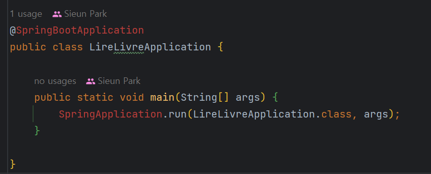
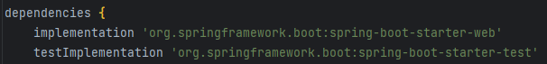
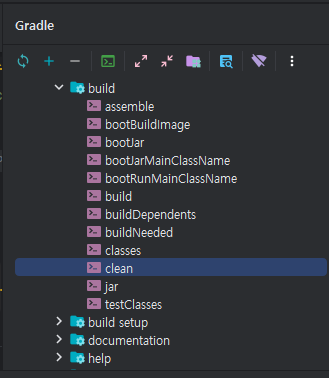
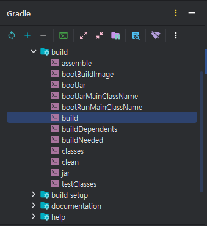
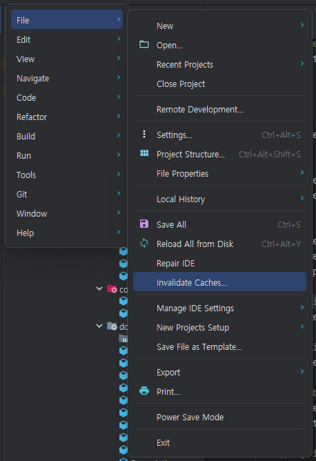
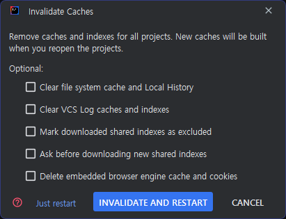
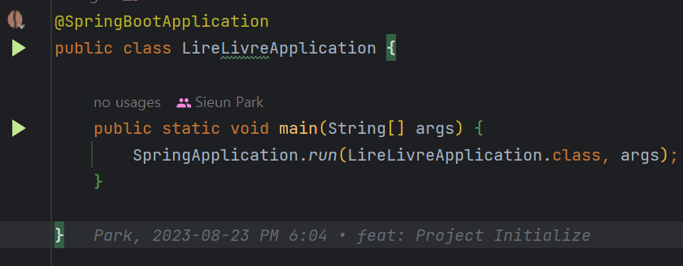

## 🐛ISSUE

`springframework`부분의 `import`가 모두 빨간 줄 처리되어 나타났다.

해당 이슈가 발생하는 곳을 모두 확인한 결과, `springframework` 부분에서 공통적으로 오류가 발생하는 것으로 확인되었기 떄문에 `gradle.build`를 살펴보았지만 별 다른 이상한 점을 발견하지 못하였다.

## ✨Solutions
### Gradle clean - build
`Gradle`을 `clean`후 `build` 한다.

> 📌 Reload All Gradle Projects를 통해서도 가능하다.

### Gradle Cache 초기화

`Invalidate And Restart` 을 누르면 캐시를 무효화하고 재시작한다.

## 🎉Done!

