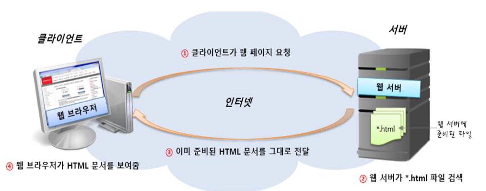
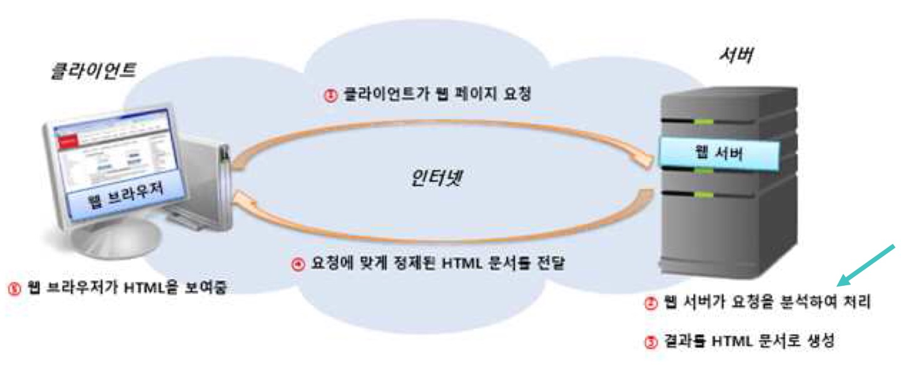
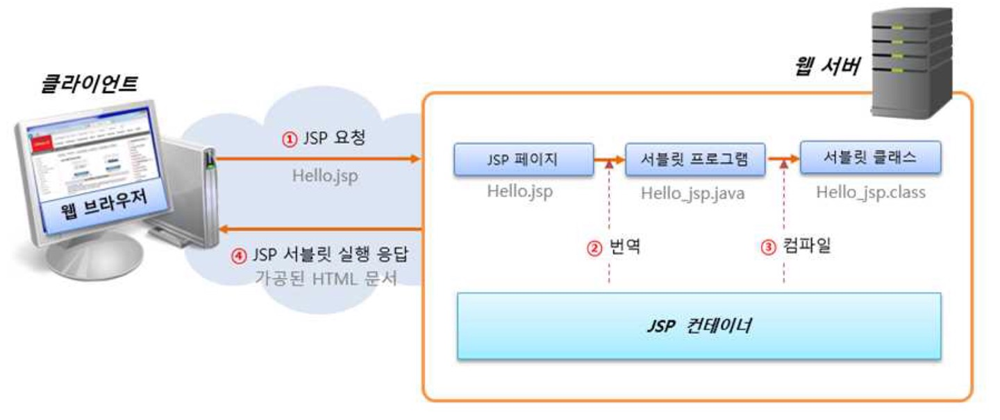

# 웹과 JSP 프로그래밍
## 인터넷과 웹의 개요
### 인터넷과 웹
- 인터넷
    - 컴퓨터가 서로 연결되어 TCP/IP라는 통신 프로토콜을 이용하여 정보를 주고 받는 전 세계의 컴퓨터 네트워크
- 웹
    - 인터넷에 연결된 컴퓨터들을 통해 사람들이 정보를 공유할 수 있는 정보 공간
    - 월드 와이드 웹의 줄임말

### 웹의 동작 원리
- 클라이언트/서버 방식
    - 클라이언트가 특정 페이지를 웹 서버에 요청(request)
    - 이를 처리하고 그 결과를 클라이언트에게 보내어 응답(response)

### 정적 웹 페이지와 동적 웹 페이지
- 정적 웹 페이지
    
    - 컴퓨터에 저장된 텍스트 파일을 그대로 보는 것
    - HTML(HyperText Markup Language)
- 동적 웹 페이지
      
    - 저장된 내용을 다른 변수로 가공 처리하여 보는 것
    - PHP(Personal Home Page), ASP(Active Server Page), JSP
    - 스프링 프레임워크
    - 노드(Node.js), HTML5

 

## JSP
### JSP의 특징
- JSP는 서블릿 기술의 확장.
- JSP는 유지 관리가 용이함.
- JSP는 빠른 개발이 가능함.
- JSP로 개발하면 코드 길이를 줄일 수 있음.

### JSP 페이지의 처리 과정

- JSP 파일은 하나의 서블릿 프로그램으로 변환되어 실행됨.
1.  Hello.jsp에서 Hello_jsp.java라는 서블릿 프로그램이 생성됨.
2. 서블릿 프로그램이 컴파일되어 Hello_jsp.class라는 서블릿 클래스 생성
