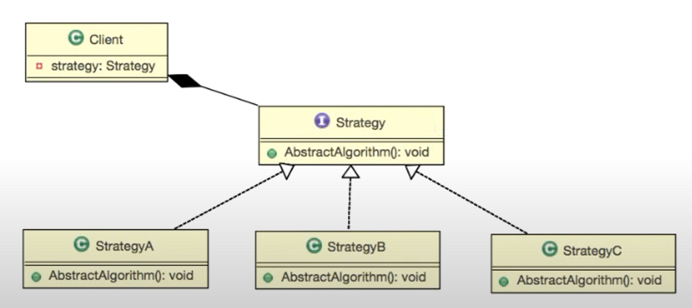

> 인프런 [자바 디자인 패턴의 이해 - Gof Design Pattern](https://www.inflearn.com/course/%EC%9E%90%EB%B0%94-%EB%94%94%EC%9E%90%EC%9D%B8-%ED%8C%A8%ED%84%B4) `섹션 1. 스트래티지 패턴` 강의를 듣고 정리한 글입니다.

# 스트레티지 패턴
### 인터페이스

- 기능에 대한 **선언과 구현의 분리**
    
    ➡️ **선언부**
    
    ```java
    public interface Ainterface {
    	public void funcA();
    }
    ```
    
    ➡️ **구현부**
    
    ```java
    public class AinterfaceImpl implements Ainterface {
    	@Override
    	public void funcA() {
    		System.out.println("AAA");
    	}
    }
    ```
    
- **기능을 사용하는 통로 제공**
    
    ```java
    public class Main {
    	public static void main(String[] args) {
    		Ainterface ainterface = new AinterfaceImpl();
    
    		ainterface.funcA();
    	}
    }
    ```
    

### 델리게이트

어떤 기능을 구현할 때, **그 책임을 다른 객체에 떠넘기는 것**

**델리게이트** ❌

```java
public class AObj {
	public void funcAA() {
		System.out.println("AAA");
		System.out.println("AAA");
	}
}
```

**델리게이트** ⭕

```java
public class AObj {
	Ainterface ainterface;
	public void funcAA() {
		ainterface.funcA();
		ainterface.funcA();
	}
}
```

### 스트레티지 패턴

여러 알고리즘을 하나의 추상적인 접근점을 만들어 접근 점에서 **서로 교환 가능하도록 하는 패턴**

🖼️ **기본적인 스트레티지 패턴의 구성**



💻 **코드**

📄 interface **Weapon**

```java
public interface Weapon {
    public void attack();
}
```

- 무기들을 접근할 수 있는 접근점

📄 class **Knife**

```java
public class Knife implements Weapon {
    @Override
    public void attack() {
        System.out.println("Knife Attack");
    }
}
```

📄 class **Sword**

```java
public class Sword implements Weapon {
    @Override
    public void attack() {
        System.out.println("Sword Attack");
    }
}
```

📄 class **GameCharacter**

```java
public class GameCharacter {
    // 접근점
    private Weapon weapon;

    // 교환 가능
    public void setWeapon(Weapon weapon) {
        this.weapon = weapon;
    }

    public void attack() {
        if (weapon == null) {
            System.out.println("Null Attack");
        } else {
            weapon.attack();
        }
    }
}
```

📄 class **Main**
```java
public class Main {
    public static void main(String[] args) {
        GameCharacter gameCharacter = new GameCharacter();

        gameCharacter.attack();

        gameCharacter.setWeapon(new Knife());
        gameCharacter.attack();

        gameCharacter.setWeapon(new Sword());
        gameCharacter.attack();
    }
}
```