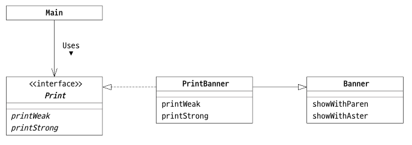
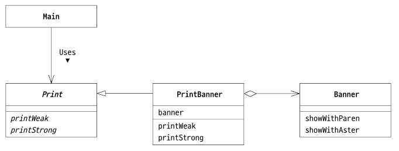

# Adaptor Pattern
### 목차
1. [Adaptor 패턴이란?](#adaptor-패턴이란)
2. [클래스에 의한 Adaptor 패턴(상속을 사용한 패턴)](#클래스에-의한-adaptor-패턴상속을-사용한-패턴)
3. [인스턴스에 의한 Adaptor 패턴(위임을 사용한 패턴)](#인스턴스에-의한-adaptor-패턴위임을-사용한-패턴)

----
## Adaptor 패턴이란?
> 사이에 끼워 재사용한다.

`Adaptor` 패턴은 무엇인가 포장해서 다른 용도로 사용할 수 있도록 하는 패턴으로, `Wrapper` 패턴이라고도 불린다.

`이미 제공된 것` - `Adaptor` - `필요한 것`

이미 제공된 것과 필요한 것 사이의 차이를 메꾸는 것이 `Adaptor` 패턴이다.

즉, 교류 100 볼트를 직류 12 볼트로 변환하기 위해 AC 어댑터를 사용하는 것과 같다.

#### 📌 Adaptor 패턴의 종류
- 클래스에 의한 Apaptor 패턴(상속을 사용한 패턴)
- 인스턴스에 의한 Adaptor 패턴(위임을 사용한 패턴)

## 클래스에 의한 Adaptor 패턴(상속을 사용한 패턴)
예제 코드는 아래와 같은 문자열을 표시한다.
```java
(Hello)
*Hello*
```



||전원의 비유|예제|
|--|--|--|
|제공된 것|교류 100볼트|Banner 클래스(showWithParen, showWithAster)|
|변환장치|어댑터|PrintBanner 클래스|
|필요한 것|직류 12볼트|Print 인터페이스(printWeak, printStrong)|

### Banner 클래스 
```java
public class Banner {
    private String string;

    public Banner(String string) {
        this.string = string;
    }

    public void showWithParen() {
        System.out.println("(" + string + ")");
    }

    public void showWithAster() {
        System.out.println("*" + string + "*");
    }
}
```

### Print 인터페이스
```java
public interface Print {
    public abstract void printWeak();
    public abstract void printStrong();
}
```

### PrintBanner 클래스
```java
public class PrintBanner extends Banner implements Print {
    public PrintBanner(String string) {
        super(string);
    }

    @Override
    public void printWeak() {
        showWithParen();
    }

    @Override
    public void printAster() {
        showWithAster();
    }
}
```

### Main 클래스
```java
public class Main {
    public static void main(String[] args) {
        Print p = new PrintBanner("Hello");
        p.printWeak();
        p.printStrong();
    }
}
```

## 인스턴스에 의한 Adaptor 패턴(위임을 사용한 패턴)



위 상속을 이용한 패턴과 다른 점은 `Print`가 인터페이스가 아니라 클래스이다.

즉, `Banner` 클래스를 사용하여 `Print` 클래스와 같은 메서드를 갖는 클래스를 만든다.

### Print 클래스
```java
public abstract class Print {
    public abstract void printWeak();
    public abstract void printStrong();
}
```

### PrintBanner 클래스
```java
public class PrintBanner extends Print {
    private Banner banner;

    public PrintBanner(String string) {
        this.banner = new Banner(string);
    }

    @Override
    public void printWeak() {
        banner.showWithParen();
    }

    @Override
    public void printString() {
        banner.showWithAster();
    }
}
```

------
## 💎 References
- [Java 언어로 배우는 디자인 패턴 입문: 쉽게 배우는 GoF의 23가지 디자인 패턴](https://product.kyobobook.co.kr/detail/S000200311846)
