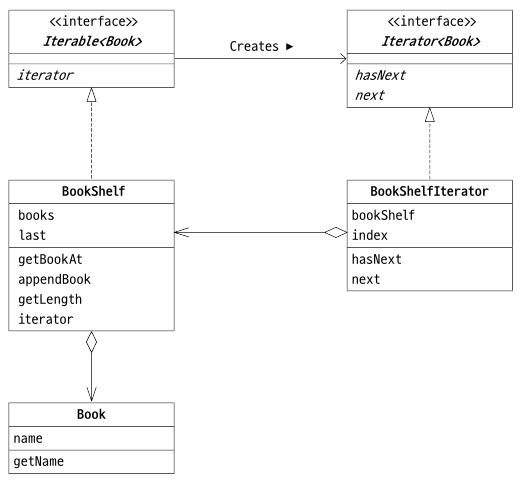

# Iterator Pattern
### 목차
- [Iterator 패턴이란?](#iterator-패턴이란)
    - [✨ 예제](#✨-예제)
        - [📄 Iterable\<E> 인터페이스](#📄-iterablee-인터페이스)
        - [📄 Iterator\<E> 인터페이스](#📄-iteratore-인터페이스)
        - [📄 Book 클래스](#📄-book-클래스)
        - [📄 BookShelf 클래스](#📄-bookshelf-클래스)
        - [📄 BookShelfIterator 클래스](#📄-bookshelfiterator-클래스)
        - [📄 Main 클래스](#📄-main-클래스)
    - [Iterator 패턴을 사용해야 하는 이유](#iterator-패턴을-사용해야-하는-이유)
        - [📌 어떻게 구현하든 Iterator를 사용할 수 있다.](#📌-어떻게-구현하든-iterator를-사용할-수-있다)

----

## Iterator 패턴이란?
> 처리를 반복한다.

`Iterator` 패턴은 무엇인가 많이 모여 있을 때 이를 순서대로 가리키며 전체를 검색하고 처리를 반복하는 것이다.

<br>

### ✨ 예제
- 책장(Bookshelf) 안에 책(Book)을 넣고, 책 이름을 차례대로 표시하는 예제



|이름|설명|
|--|--|
|Iterable<E>|집합체를 나타내는 인터페이스(java.lang 패키지)|
|Iterator<E>|처리를 반복하는 반복자를 나타내는 인터페이스(java.util 패키지)|
|Book|책을 나타내는 클래스|
|BookShelf|책장을 나타내는 클래스|
|BookShelfIterator|책장을 검색하는 클래스|
|Main|동작 테스트용 클래스|

#### 📄 Iterable\<E> 인터페이스
`Iterable<E>` 인터페이스는 처리를 반복할 대상을 나타내며 `java.lang` 패키지에 선언되어 있다.

- `Iterable<E>` 인터페이스(java.lang.Iterable)
    ```java
    public interface Iterable<E> {
        public abstract Iterator<E> iterator();
    }
    ```

#### 📄 Iterator\<E> 인터페이스
`Iterator<E>` 인터페이스는 하나하나의 요소 처리를 반복하기 위한 것으로 루프 변수와 같은 역할을 한다.

- `Iterator<E>` 인터페이스(java.util.Iterator)
    ```java
    public interface Iterator<E> {
        public abstract boolean hasNext();
        public abstract E next();
    }
    ```
    - `hasNext()`: 다음 요소가 존재하면 true, 존재하지 않으면 false를 반환한다.
    - `next()`: 집합체의 요소 하나를 반환한다.

#### 📄 Book 클래스
```java
public class Book {
    private String name;

    public Book(String name) {
        this.name = name;
    }

    public String getName() {
        return name;
    }
}
```

#### 📄 BookShelf 클래스
```java
import java.util.Iterator;

public class BookShelf implements Iterable<Book> {
    private Book[] books;
    private int last = 0;

    public BookShelf(int maxsize) {
        this.books = new Book[maxsize];
    }

    public Book getBookAt(int index) {
        return books[index];
    }

    public void appendBook(Book book) {
        this.books[last] = boook;
        last++;
    }

    public int getLength() {
        return last;
    }

    public int getLength() {
        return last;
    }

    @Override
    public Iterator<Book> iterator() {
        reurn new BookShelfIterator(this);
    }
}
```

#### 📄 BookShelfIterator 클래스
```java
import java.util.Iterator;
import java.util.NoSuchElementException;

public class BookShelfIterator implements Iterator<Book> {
    private BookShelf bookShelf;
    private int index;

    public BookShelfIterator(BookShelf bookShelf) {
        this.bookShelf = bookShelf;
    }

    @Override
    public boolean hasNext() {
        if (index < bookShelf.getLength()) {
            return true;
        } else {
            return false;
        }
    }

    @Override
    public Book next() {
        if (!hasNext()) {
            throw new NoSuchElementException();
        } 
        Book book = bookShelf.getBookAt(index);
        index++;
        return book;
    }
}
```

#### 📄 Main 클래스
```java
import java.util.Iterator;

public class Main {
    public static void main(String[] args) {
        BookShelf bookShelf = new BookShelf(4);

        bookShelf.appendBook(new Book("Around the World in 80 Days"));
        bookShelf.appendBook(new Book("Bible"));
        bookShelf.appendBook(new Book("Cinderella"));
        bookShelf.appendBook(new Book("Daddy-Long-Legs"));

        // 명시적으로 Iterator를 사용하는 방법
        Iterator<Book> it = bookShelf.iterator();
        while (it.hasNext()) {
            Book book = it.next();
            System.out.println(book.getName());
        }
        System.out.println();

        // 확장 for문을 사용하는 방법
        for (Book book: bookShelf) {
            System.out.println(book.getName());
        }
        System.out.println();
    }
}
```

### Iterator 패턴을 사용해야 하는 이유
#### 📌 어떻게 구현하든 Iterator를 사용할 수 있다.
```java
while (it.hasNext()) {
    Book book = it.next();
    System.out.println(book.getName());
}
```
위 코드를 보면 `Iterator`의 메서드인 `hasNext()`와 `next()`만 존재한다.

즉, `BookShelf` 구현에 사용된 메서드는 사용되지 않는다.

👉 while 루프는 BookShelf 구현에 의존하지 않는다.

> ❗ 만약 배열이 아닌 `ArrayList`로 `BookShelf`를 구현한다면, while 루프는 `BookShelf` 구현에 의존하지 않기 때문에 변경 없이 동작 가능하다.

------
## 💎 References
- [Java 언어로 배우는 디자인 패턴 입문: 쉽게 배우는 GoF의 23가지 디자인 패턴](https://product.kyobobook.co.kr/detail/S000200311846)