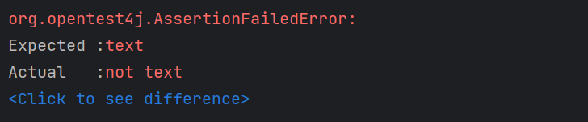
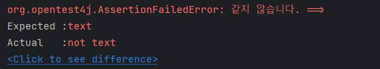
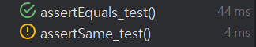

### 목차
- [JUnit5 Assert Methods](#junit5-assert-methods)
    - [assertEquals / assertNotEquals](#assertequals--assertnotequals)


---
## JUnit5 Assert Methods
> https://junit.org/junit5/docs/current/api/org.junit.jupiter.api/org/junit/jupiter/api/Assertions.html

### assertEquals / assertNotEquals
`assertEquals`는 `expected`와 `actual`가 같은 값을 가졌는지 확인한다.

`expected`와 `actual`이 같은 값을 가졌으면 true를 반환하고, 같지 않으면 false를 반환한다.

```java
public static void assertEquals(Object expected, Object actual) {
    AssertEquals.assertEquals(expected, actual);
}
```
```java
public static void assertEquals(Object expected, Object actual, String message) {
    AssertEquals.assertEquals(expected, actual, message);
}
```

다음과 같이 `expected`와 `actual`을 비교한다.
```java
static void assertEquals(Object expected, Object actual, String message) {
    if (!objectsAreEqual(expected, actual)) {
        failNotEqual(expected, actual, message);
    }
}
```
`objectsAreEqual`을 통해 `expected`와 `actual`을 비교하고, 두 값이 다를 때 `failNotEqual`을 실행한다.
```java
static boolean objectsAreEqual(Object obj1, Object obj2) {
    if (obj1 == null) {
        return (obj2 == null);
    }
    return obj1.equals(obj2);
}
```
두 값이 다를 때 실행되는 `failNotEqual`은 `AssertionFailedError`를 발생시켜 테스트를 통과하지 못하도록 한다.
```java
static void failNotEqual(Object expected, Object actual, String message) {
    fail(format(expected, actual, message), expected, actual);
}

static void fail(String message, Object expected, Object actual) {
    throw new AssertionFailedError(message, expected, actual);
}
```

#### 📌 Example
다음은 정상적으로 테스트가 통과되는 예이다.
```java
@Test
public void assertEqauls_text() {
    String textText = "text";
    assertEquals(testText, "text");
}
```

만약 다음과 같이 두 값이 다르다면 `AssertionFailedError`가 발생하게 된다.

```java
@Test
public void assertEquals_test() {
    String testText = "text";
    assertEquals(testText, "not text");
}
```



`expected`와 `actual`이 같지 않을 때 출력할 메시지를 마지막 인자인 `message`를 통해 지정할 수 있다.

```java
@Test
public void assertEquals_test() {
    String testText = "text";
    assertEquals(testText, "not text", "같지 않습니다.");
}
```



### assertSame / assertNotSame
`assertSame`은 두 객체가 동일한 객체인지 확인한다.

```java
public static void assertSame(Object expected, Object actual) {
    AssertEquals.assertSame(expected, actual);
}
```
```java
public static void assertSame(Object expected, Object actual, String message) {
    AssertEquals.assertSame(expected, actual, message);
}
```

다음과 같이 `expected`와 `actual`을 비교한다.

`assertEquals`와 동일하게 두 객체를 비교하는 것에서 동일하지만, `assertEquals`는 두 값이 동일한지를 비교하고 `assertSame`은 두 객체가 동일한 객체인지 주소 값을 비교한다.

```java
static void assertSame(Object expected, Object actual, String message) {
    if (expected != actual) {
        failNotSame(expected, actual, message);
    }
}
```

`assertSame`이 주소 값을 통해 두 객체를 비교하는 메서드이기 때문에 `clone`을 통해 복사된 객체를 비교하면 테스트가 실패하게 된다.
```java
@Test
public void assertEquals_test() {
    ArrayList<Integer> list1 = new ArrayList<>();
    ArrayList<Integer> list2 = (ArrayList<Integer>) list1.clone();

    assertEquals(list1, list2);
}

@Test
public void assertSame_test() {
    ArrayList<Integer> list1 = new ArrayList<>();
    ArrayList<Integer> list2 = (ArrayList<Integer>) list1.clone();

    assertSame(list1, list2);
}
```

아래 사진에서 ArrayList를 clone하여 비교했을 때, 값을 비교하는 `assertEquals`는 테스트가 통과되는 반면 `assertSame`은 테스트가 통과되지 못했다.



두 객체가 같지 않으면 `AssertionFailedError`를 발생시켜 테스트를 통과하지 못하게 한다.
```java
private static void failNotSame(Object expected, Object actual, String message) {
    fail(format(expected, actual, message), expected, actual);
}
```
```java
static void fail(String message, Object expected, Object actual) {
    throw new AssertionFailedError(message, expected, actual);
}
```

#### 📌 Example
다음은 정상적으로 테스트가 통과되는 예이다.

```java
@Test
public void assertEquals_test() {
    String testText = "text";
    assertSame(testText, "text");
}
```

### assertTrue / assertFalse
`assertTrue`는 값이 `true`인지 확인한다.

### assertNull / assertNotNull
`assertNull`는 값이 `null`인지 확인한다.

### assertAll
`assertAll`은 

### assertThrows
`assertThrows`는 

### assertTimeout

### fail()
`fail`은 테스트를 실패처리한다.

---
## references
- [https://incheol-jung.gitbook.io/docs/study/undefined-3/chap-05.-junit-5](https://incheol-jung.gitbook.io/docs/study/undefined-3/chap-05.-junit-5)
- [https://velog.io/@roycewon/JUnit-Assert-Methods1](https://velog.io/@roycewon/JUnit-Assert-Methods1)
- [http://blog.iotinfra.net/?p=1851](http://blog.iotinfra.net/?p=1851)