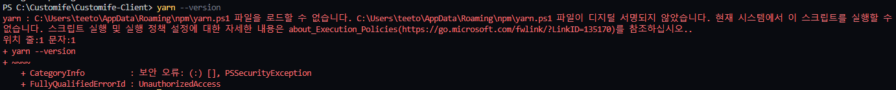
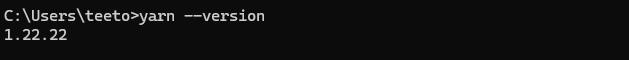
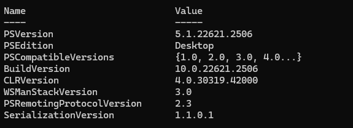
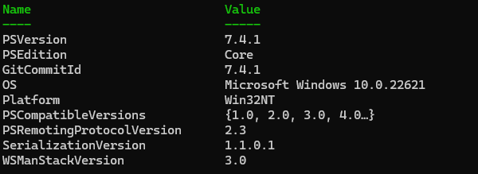
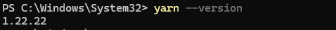

# PowerShell 보안 정책에 의한 Yarn 오류 해결
## 🐛ISSUE

`VSC`에 내장된 터미널에서 `PowerShell`을 사용해 `Yarn`을 다운받고 `yarn` 명령어를 사용할 때 보안 오류가 발생했다.



위 오류 상황 전 과정은 다음과 같다. 

1. `Yarn` 설치
    
    ```java
    npm install -g yarn
    ```
    
2. `Yarn` 설치 확인 겸 버전 확인
    
    ```java
    yarn --version
    ```
    

(∴ 진짜 설치만 하고 yarn 명령어 실행만 함)

## ✨SOLUTIONS

해당 오류는 `PowerShell`의 스크립트 실행 보안 정책이 `Restricted`로 설정되어 있어 발생하는 문제이다.

때문에 다음 세 가지 방식을 사용할 수 있다.

- `PowerShell` 대신 `cmd`를 사용한다.
- `PowerShell`의 보안 정책을 변경한다.
- `PowerShell` 버전 업그레이드
    
    → 윈도우 기본 PowerShell은 오래된 버전이기 떄문에 해당 오류가 발생하고, 최신 버전은 실행 정책의 영향을 받지 않는다.
    

### 1. PowerShell 대신 cmd 사용

`cmd`를 사용했을 때, 정말 해당 오류가 발생하지 않는지 확인해보았다.




(진짜 발생하지 않는다.)

### 2. PowerShell의 보안 정책 변경

사실 나 같은 경우, 보안 정책을 건들이기 꺼려져서 해당 방법을 사용하지 않았다.

`PowerShell`을 관리자 권한으로 실행하여 다음 명령어를 수행한다.

```java
Set-ExecutionPolicy Unrestricted
```

이후 아래 명령어로 변경 내용을 확인하고 `yarn` 명령어를 사용해보면 잘 동작될 것이라고 한다.

```java
ExecutionPolicy
```

### 3. PowerShell 버전 업그레이드

윈도우에 기본으로 내장되어 있는 `PowerShell`은 오래된 버전이 내장되어 있기 때문에 해당 오류가 발생하고, 최신 버전은 실행 정책의 영향을 받지 않는다고 한다.

> https://learn.microsoft.com/ko-kr/powershell/scripting/install/installing-powershell-on-windows?view=powershell-7.4 

위 링크에 Windows에 PowerShell을 설치할 수 있는 방법이 잘 설명되어 있으니 참고하면 된다.

궁금해서 위 링크대로 최신 버전의 PowerShell을 다운받고 내장된 구 버전 PowerShell과 비교해보았다.

우선 원래 있던 PowerShell의 버전은 `5.1` 버전이다.




(PowerShell에서 `$PSVersionTable` 명령어로 버전을 확인할 수 있다.

해당 `PowerShell`에서 `yarn --version`을 사용하면 위와 같은 오류가 발생한다.


다운받은 최신 버전 `PowerShell`은 `7.4.1` 버전이다.




위 버전에서 `yarn --version`을 사용하면 오류가 발생하지 않는다.



---

## references

- https://smoh.tistory.com/446
- [https://www.inflearn.com/questions/483224/npm-install-로-문제없이-yarn-설치를-했는데-yarn-이-실행이-안되네요](https://www.inflearn.com/questions/483224/npm-install-%EB%A1%9C-%EB%AC%B8%EC%A0%9C%EC%97%86%EC%9D%B4-yarn-%EC%84%A4%EC%B9%98%EB%A5%BC-%ED%96%88%EB%8A%94%EB%8D%B0-yarn-%EC%9D%B4-%EC%8B%A4%ED%96%89%EC%9D%B4-%EC%95%88%EB%90%98%EB%84%A4%EC%9A%94)