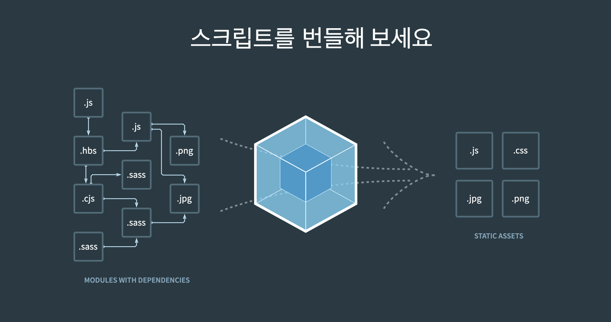

# Webpack?



`Webpack`은 웹 페이지를 만들 때 생기는 파일들(`js`, `css`, `html`, `assets` 등)을 모듈 단위로 나누어 필요할 때마다 `번들링`(Bundling)하여 하나의 결과물로 산출시키는 `모듈 번들러`이다.

이렇게 번들링된 파일은 웹 서버에서 정적 파일로 제공된다.

## Webpack을 사용하는 이유

### **파일 단위의 자바스크립트 모듈 관리의 필요성**

자바스크립트에서는 변수의 유효 범위(스코프)는 기본적으로 전역 범위를 가진다.

만약 자바스크립트 코드를 모듈화하지 않으면 다음과 같은 일이 벌어진다.

```jsx
// module1.js
var foo = 10;
```

```jsx
// module2.js
foo = 20;
```

```html
<!-- main.html-->
<body>
		<script scr="./module1.js"></script>
		<script scr="./module2.js"></script>
		
		<script>console.log(foo);</script>
</body>
```

위 코드에서 `foo`는 전역변수이기 때문에 `console.log(foo)`로 `foo`의 값을 찍어보면 `20`인 것을 알 수 있다.

이렇게 다른 파일에서 사용한 변수를 실수로 변경할 수 있게 되면, 프로젝트의 규모가 커지면 의도치 않게 에러가 발생할 수 있다.

이러한 문제를 해결하기 위해 다음 라이브러리를 통해 javascript의 파일을 모듈로 관리하게 되었다.

- AMD
- Common.js

**👉 이 문제를 `Webpack`은 다양한 모듈화 방식 중 `ES Module 문법`과 `Webpack`의 모듈 번들링으로 해결한다.**

### 웹 애플리케이션의 빠른 로딩 속도와 높은 성능

위에서 설명한 것처럼 `Webpack`은 웹 페이지를 만들 때 생기는 파일들을 모듈 단위로 나누어 `필요할 때마다` 조합하여 번들링한다.

만약 페이지에서 사용하는 파일의 수가 매우 많으면, 웹 애플리케이션의 로딩 속도가 매우 느릴 것이다.

이런 로딩 속도를 개선하기 위해 다음과 같은 방법을 사용해 왔다.

- 웹 태스크 매니저를 이용하여 파일들을 압축하고 병합하는 작업
- 초기 페이지 로딩 속도를 위해 나중에 필요한 자원을 나중에 요청하는 레이지 로딩(lazy loading)

**👉 이 문제를 `Webpack`은 `Loader` 속성과 `Code Splitting` 기능을 사용하여 해결한다.**

## Webpack의 빌드 과정

### Entry

`Entry` 속성은 `Webpack`에서 웹 자원을 변환하기 위해 필요한 최초 진입점이자 자바스크립트 파일 경로이다.

```jsx
// webpack.config.js
module.exports = {
		entry: './src/index.js'
}
```

위 `webpack.config.js`는 `Webpack`을 실행했을 때, `./src/index.js` 파일을 대상으로 `Webpack`이 빌드를 수행한다는 코드이다.

**📌 `Entry`에 들어가야 하는 내용은 다음과 같다.**

> 전반적인 구조와 내용이 담겨야 한다.
> 

```jsx
// index.js
import LoginView from './LoginView.js';
import HomeView from './HomeView.js';
import PostView from './PostView.js';

function initApp() {
		LoginView.init();
		HomeView.init();
		PostView.init();
}

initApp();
```

`Webpack`은 위 `entry`에 작성된 파일을 가지고 해당 웹 애플리케이션에서 사용되는 모듈들의 연관 관계를 분석하여 파일들을 빌드한다.

때문에 위 코드에서 `index.js` 파일에 `LoginView.js`, `HomeView.js`, `PostView.js`가 포함되어 있기 떄문에, `Webpack`을 실행하면 해당 파일들의 내용을 빌드한다.

이때, `Entry` 포인트는 아래와 같이 여러 개일 수 있다.

```jsx
entry: {
		login: './src/LoginView.js',
		main: './src/MainView.js'
}
```

이렇게 `Entry` 포인트를 분리하는 경우는 싱글 페이지 애플리케이션이 아닌 특정 페이지로 진입했을 때 서버에서 해당 정보를 내려주는 멀티 페이지 애플리케이션에 적합하다.

### Output

`output` 속성은 `Webpack`을 돌리고 난 결과물의 파일 경로를 객체 형식으로 나타낸다.

```jsx
// webpack.config.js
module.exports = {
		output: {
				filename: 'bundle.js'
		}
}
```

**📌 `Output` 속성의 옵션 형태**

`output` 속성은 최소한 `filename`을 지정해야 하고, 일반적으로 `path`를 함께 정의한다.

```jsx
// webpack.config.js
var path = require('path');

module.exports = {
		output: {
				filename: 'bundle.js',
				path: path.resolve(__dirname, './dist')
		}
}
```

- `filename`: `Webpack`으로 빌드한 파일의 이름
- `path`: 해당 파일의 경로

**📌 `Output` 파일 이름 옵션**

위 `filename` 속성은 여러 옵션을 포함할 수 있다.

- 결과 파일 이름에 `entry` 속성을 포함하는 옵션
    
    ```jsx
    module.exports = {
    	  output: {
    		    filename: '[name].bundle.js'
    	  }
    };
    ```
    
- 결과 파일 이름에 `Webpack` 내부적으로 사용하는 모듈 ID를 포함하는 옵션
    
    ```jsx
    module.exports = {
    	  output: {
    		    filename: '[id].bundle.js'
    	  }
    };
    ```
    
- 매 빌드 시 고유 해시 값을 붙이는 옵션
    
    ```jsx
    module.exports = {
    	  output: {
    		    filename: '[name].[hash].bundle.js'
    	  }
    };
    ```
    
- `Webpack`의 각 모듈 내용을 기준으로 생성된 해시 값을 붙이는 옵션
    
    ```jsx
    module.exports = {
    	  output: {
    		    filename: '[chunkhash].bundle.js'
    	  }
    };
    ```
    

### Loader

`Loader`는 `Webpack`이 웹 애플리케이션을 해석할 때, Javascript 파일 이외의 웹 자원(HTML, CSS, Images, font 등)을 변환할 수 있도록 돕는 속성이다.

```jsx
// webpack.config.js
module.exports = {
		module: {
				rules: []
		}
}
```

**📌 Loader가 필요한 이유**

```jsx
// webpack.config.js
module.exports = {
		entry: './app.js',
		output: {
				filename: 'bundle.js'
		}
}
```

위처럼 `webpack.config.js`를 구성했을 경우에 아래 코드를 `Webpack`으로 빌드하면 에러가 발생하게 된다.

```jsx
// app.js
import './common.css';

console.log('css loaded');
```

```css
/* common.css */
p {
		color: blue;
}
```

이 에러를 해결하기 위해 `common.js`를 해석하기 위한 로더를 추가해야 한다.

**📌 CSS Loader를 적용하는 방법**

- `npm`으로 CSS Loader를 설치한다.
    
    ```
    npm i css-loader -D
    ```
    
- `webpack.config.js` 파일을 변경한다.
    
    ```jsx
    // webpack.config.js
    module.exports = {
    		entry: './app.js',
    		output: {
    				filename: 'bundle.js'
    		},
    		module: {
    				rules: [
    						test: /\.css$/,
    						use: ['css-loader']
    				]
    		}
    }
    ```
    
    - `test`: 로더를 적용할 파일 유형(보통 정규표현식을 사용한다.)
    - `use`: 해당 파일에 적용할 로더의 이름

**📌 자주 사용되는 Loader들**

- Babel Loader
- Sass Loader
- File Loader
- Vue Loader
- TS Loader

만약 로더를 여러 개 사용하는 경우, 다음과 같이 설정하면 된다.

```jsx
// webpack.config.js
module.exports = {
	  module: {
		    rules: [
			      { test: /\.css$/, use: 'css-loader' },
			      { test: /\.ts$/, use: 'ts-loader' },
			      // ...
		    ]
	  }
}
```

**📌 Loader 적용 순서**

`Loader`는 오른쪽에서 왼쪽 순으로 적용된다.

```jsx
module: {
	  rules: [
		    {
			      test: /\.scss$/,
			      use: ['css-loader', 'sass-loader']
		    }
	  ]
}
```

다음과 같이 `Loader`를 설정했을 경우, `sass-loader`로 전처리한 이후 `css-loader`를 적용한다.

아래와 같이 `Loader`를 배열로 입력하고, 옵션을 포함하도록 작성할 수 있다.

```jsx
module: {
	  rules: [
		    {
			      test: /\.css$/,
			      use: [
				        { loader: 'style-loader' },
				        {
					          loader: 'css-loader',
					          options: { modules: true }
				        },
				        { loader: 'sass-loader' }
			      ]
		    }
	  ]
}
```

### Plugin

`Plugin`은 `Webpack`의 기본적인 동작에 추가적인 기능을 제공하는 속성이다.

```jsx
// webpack.config.js
module.exports = {
		plugins: []
}
```

**📌 Loader vs Plugin**

- Loader: 파일을 해석하고 변환하는 과정에 관여
- Plugin: 해당 결과물의 형태를 바꾸는 역할

**📌 Plugin 추가하기**

```jsx
// webpack.config.js
var webpack = require('webpack');
var HtmlWebpackPlugin = require('html-webpack-plugin');

module.exports = {
	  plugins: [
		    new HtmlWebpackPlugin(),
		    new webpack.ProgressPlugin()
	  ]
}
```

- `HtmlWebpackPlugin`: 웹팩으로 빌드한 결과물로 HTML 파일을 생성해주는 플러그인
- `ProgressPlugin`: 웹팩의 빌드 진행율을 표시해주는 플러그인

**📌 자주 사용하는 Plugin**

- split-chunks-plugin
- clean-webpack-plugin
- image-webpack-loader
- webpack-bundle-analyzer-plugin

### Mode

`Mode`는 `Webpack` 버전 4부터 추가된 속성으로, `Webpack` 빌드시 어떤 방식으로 빌드할 것인지 결정하는 속성이다.

```jsx
// webpack.config.js
module.exports = {
		mode: 'production'
}
```

해당 속성은 아래 중 하나의 파라미터를 사용할 수 있다.

- `production`: 배포를 위한 빌드로, 코드가 최적화되어 파일 크기가 최소화되어 빌드되며, 기본값이다.
- `development`: 개발을 위한 빌드로, 빠르게 빌드된다.
- `none`: 기본 최적화 옵션을 해제하여 빌드된다.

---

## references

- https://myung-ho.tistory.com/98
- https://joshua1988.github.io/webpack-guide/motivation/why-webpack.html
- https://joshua1988.github.io/webpack-guide/motivation/problem-to-solve.html
- https://webpack.kr/guides/code-splitting/
- https://joshua1988.github.io/webpack-guide/concepts/overview.html
- https://cocobi.tistory.com/157