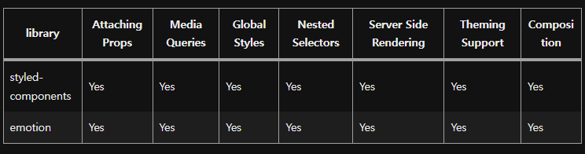

## Emotion과 Styled-component
`Emotion`과 `Styled-component` 모두 React에서 `CSS-in-JS`를 통해 스타일 작업이 가능하도록 하는 라이브러리이다.

## Emotion과 Styled-component의 차이점
### 기능

위 표를 보면 사실상 `Emotion`과 `Styled-component`가 제공하는 기능은 거의 동일하다.

### 성능
`Emotion`가 `Styled-component`보다 번들 사이즈가 작아 조금 가볍고 빠르다.
(※core만 사용했을 경우)

### 속도
`Emotion`이 `Styled-component`보다 근소하게 빠르다.

### 결론
`Emotion`과 `Styled-component`는 모든 면에서 크게 차이가 나지는 않지만, 일단 `Emotion`이 더 낫기는 하다.

## Emotion의 차별점
### css props
`Emotion`은 React 컴포넌트를 스타일링할 때, css prop을 직접 컴포넌트에 전달할 수 있다.

```typescript
import { css } from '@emotion/react';

function App() {
    return (
        <div
            css={css`
                background=color: palevioletred;
                color: white;
            `}
        >
        Emotion!
        </div>
    )
}
```
위 방법은 클래스 이름을 생성하여 컴포넌트에 주입하는 방식이기 때문에 클래스 이름을 고민할 필요가 없다!

## Emotion을 Styled-component처럼 사용하기
### styles 파일 만들기
```typescript
// 📄 User.styles.tsx
import styled from '@emotion/styled';

export const TopBox = styled.div`
    margin-right: 25px;
`;
```

### styles 파일을 컴포넌트에 import 하여 사용하기
```typescript
import React from 'react';
import { TopBox } from './Users.styled';

export const User = () => {
    return <TopBox>test</TopBox>;
}
```

---
## references
- [https://github.com/jsjoeio/styled-components-vs-emotion](https://github.com/jsjoeio/styled-components-vs-emotion)
- [https://velog.io/@bepyan/styled-components-%EA%B3%BC-emotion-%EB%8F%84%EB%8C%80%EC%B2%B4-%EC%B0%A8%EC%9D%B4%EA%B0%80-%EB%AD%94%EA%B0%80](https://velog.io/@bepyan/styled-components-%EA%B3%BC-emotion-%EB%8F%84%EB%8C%80%EC%B2%B4-%EC%B0%A8%EC%9D%B4%EA%B0%80-%EB%AD%94%EA%B0%80)