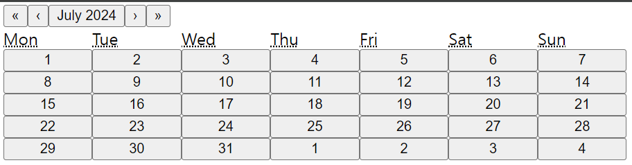
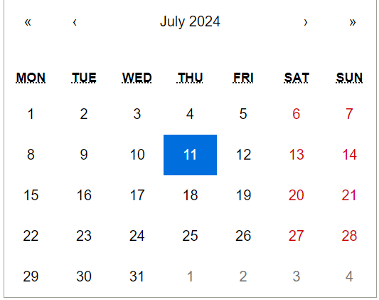

### 목차

---
> React Typescript 기반으로 작성됨.

<br>

## react-calendar 설치하기
```
npm install react-calendar
```
```
yarn add react-calendar
```

## react-calendar 사용하기
`react-calendar`의 기본적인 사용 방법은 다음과 같다.

```tsx
import Calendar from 'react-calendar';

const ReactCalendar = () => {
    const [value, setValue] = useState(new Date());

    const onChange = () => {
        setValue(value);
    };

    return (
        <div>
            <Calendar onChange={onChange} value={value}></Calendar>
        </div>
    )
}
```

위와 같이 기본적인 코드를 통해 다음과 같은 화면을 볼 수 있다.



<br>

### Calendar

`react-calendar`의 `Calendar` 컴포넌트에서는 다음과 같은 Props를 사용할 수 있다. (개많다.)

- **activeStartDate**: 맨 처음 캘린더에 표시될 날짜를 설정한다. 
  - default: (today)
  - ex: `new Date(2017, 0, 1)`
- **allowPartialRange**: 
  - default: false
  - ex: true
- **calendarType**: 캘린더의 타입을 설정한다.
  - default: locale로 주어진 지역에서 가장 흔히 쓰이는 캘린더 타입
  - ex: `iso8601`
- **defaultActiveStartDate**: 맨 처음 기본적으로 보여질 기간을 설정한다. 
  - 좀 더 제어된 방식으로 사용하려면 `activeStartDate` props를 사용한다.
  - default: (today)
  - ex: `new Date(2017, 0, 1)`
- **defaultValue**: 초기에 선택될 value를 설정한다. 
  - 하나의 값 또는 두 값을 포함한 배열을 사용할 수 있다.
  - 좀 더 제어된 방식으로 사용하려면 `value` props를 사용한다.
  - default: n/a
  - ex: `Date: new Date()`, `An array of dates: [new Date(2017, 0, 1), new Date(2017, 7, 1)]`
- **defaultView**: 기본 캘린더 보기를 설정한다.
  - 설정 가능한 값은 `month`, `year`, `decade`, `century`가 가능하다.
  - default: 가장 자세한 보기
  - ex: `year`
- **formatDay**: Day 타일 레이블의 기본 포멧을 재정의한다.
  - default: (default formatter)
  - ex: `(locale, date) => formatDate(date, 'd')`
- **formatMonth**: Month 타일 레이블의 기본 포멧을 재정의한다.
  - default: (default formatter)
  - ex: `(locale, date) => formatDate(date, 'MMM')`
- **formatShortWeekday**: weekday 이름의 짧은 버전 기본 포멧을 재정의한다.
  - default: (default formatter)
  - ex: `(locale, date) => formatDate(date, 'dd')`
- **formatWeekday**: weekday 이름의 기본 포멧을 재정의한다.
  - default: (default formatter)
  - ex: `(locale, date) => formatDate(date, 'dd')`
- **formatYear**: 맨 위 네비게이션 섹션의 Year의 포멧을 재정의한다.
  - default: (default formatter)
  - ex: `(locale, date) => formatDate(date, 'YYYY')`
- **goToRangeStartOnSelect**: 날짜 범위의 끝을 선택했을 때, 범위의 처음으로 이동할지를 결정한다.
  - default: true
  - ex: false
- **locale**: 캘린더의 언어를 설정한다.
  - default: 서버 locale이나 유저 브라우저 세팅
  - ex: `hu-HU`
- **maxDate**: 유저가 선택할 수 있는 맥시멈 날짜를 설정한다.
  - default: n/a
  - ex: `Date: new Date()`
- **minDate**: 
- **maxDetail**: 유저가 가장 디테일하게 볼 수 있는 보기 설정을 설정한다.
  - 설정 가능한 선택지는 `month`, `year`, `decade`, `century`가 있다.
  - default: `month`
  - ex: `year`
- **minDetail**: 유저가 가장 덜 디테일하게 볼 수 있는 보기 설정을 설정한다.
  - 설정 가능한 선택지는 `month`, `year`, `decade`, `century`가 있다.
  - default: `century`
  - ex: `decade`
- **navigationAriaLabel**: 캘린더 네비게이션 바 위에 `aria-label`을 랜더링할지 설정한다.
  - default: n/a
  - ex: `"Go up"`
- **navigationAriaLive**: 캘린더 네비게이션 바 위에 `aria-live`을 랜더링할지 설정한다.
  - default: undefined
  - ex: `"polite"`
- **navigationLabel**: 캘린더 네비게이션 바 위에 `label`을 렌더링할지 설정한다.
  - default: (default label)
  - ex: ({ date, label, locale, view }) => alert(\`Current view: ${view}, date: ${date.toLocaleDateString(locale)}`)
- **next2Label**: 탐색 창에서 다음 버튼을 설정한다.
  - null로 설정하면 숨겨진다.
  - default: `"»"`
  - ex: 
    - String: `"»"`
    - React element: `<DoubleNextIcon />`
- **nextLabel**: 탐색 창에서 다음 버튼을 설정한다.
  - null로 설정하면 숨겨진다.
  - default: `"›"`
  - ex: 
    - String: `"›"`
    - React element: `<NextIcon />`
- **onActiveStartDateChange**: 활성화된(현재 보여지는) 년, 월, 일이 변경될 때마다 실행되는 함수를 설정한다.
  - default: n/a
  - ex: ({ action, activeStartDate, value, view }) => alert('Changed view to: ', activeStartDate, view)
- **onChange**: 유저가 아이템을 클릭했을 때 실행되는 함수를 설정한다.
  - default: n/a
  - ex: (value, event) => alert('New date is: ', value)
- **onClickDay**: 유저가 Day를 클릭했을 때 실행할 함수를 설정한다.
  - default: n/a
- **tileContent**: 날짜 칸에 보여지는 컨텐츠를 설정한다.
  - default: n/a
  - ex:
    - String: `"Sample"`
    - React element: `<TileContent />`
    - Function: ({ activeStartDate, date, view }) => view === 'month' && date.getDay() === 0 ? <p>It's Sunday!</p> : null
- **tileDisable**: 특정 날에 보여지는 컨텐츠를 보이지 않게 설정한다.
  - default: n/a
  - ex: ({ activeStartDate, date, view }) => date.getDay() === 0
- **value**: 캘린더의 값.
  - default: n/a
  - ex:
    - String: `"2017-01-01"`
    - Date: `new Date()`
    - An array of dates: `[new Date(2017, 0, 1), new Date(2017, 7, 1)]`
    - An array of strings: `['2017-01-01', '2017-08-01']`
- **showNeighboringMonth**: 앞뒤 날의 이어지는 날짜를 보이도록 할지를 설정한다.
  - default: true
  - ex: false

### css 커스텀하기

`react-calendar`에서 지원해주는 기본적인 css를 입히려면 아래 import를 추가하면 된다.

```tsx
import 'react-calendar/dist/Calendar.css';
```



만약 이 css를 커스텀하려면 `node_modules/react-calendar/dist/Calendar.css` 파일의 내용을 가져와 커스텀한다.

