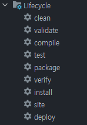

## pom.xml(Project Object Model) 살펴보기
- 메이븐 기능을 사용하기 위해 작성하는 파일
- 프로젝트, 의존성 라이브러리, 빌드 등의 정보 및 해당 프로젝트를 관리하는 데 필요한 내용이 기술되어 있음.

### 빌드 관리 도구
- JVM이나 WAS가 프로젝트를 인식하고 실행할 수 있게 소스코드와 프로젝트에 사용된 파일들을 빌드하는 도구
- 개발 규모가 커질수록 관리할 라이브러리가 많아지고, 라이브러리 간 버전 호환성을 체크해야 함.
    - 빌드 관리 도구를 사용하면 해결할 수 있다!

### 메이븐
- 자바 기반의 프로젝트를 빌드하고 관리하는 데 사용하는 도구
- 메이븐의 특징
    - `pm.xml` 파일에 필요한 라이브러리를 추가하면 해당 라이브러리에 필요한 라이브러리까지 함께 내려받아 관리함
- 메이븐의 대표 기능
    - `프로젝트 관리`:  프로젝트 버전과 아티팩트를 관리함.
    - `빌드 및 패키징`: 의존성을 관리하고 설정된 패키지 형식으로 빌드를 수행함.
    - `테스트`: 빌드를 수행하기 전에 단위 테스트를 통해 작성된 애플리케이션 코드의 정상 동작 여부를 확인함.
    - `배포`: 빌드가 완료된 패키지를 원격 저장소에 배포함.

### 메이븐의 생명주기

- 크게 기본 생명주기(Default LifeCycle), 클린 생명주기(Clean LifeCycle), 사이트 생명주기(Site LifeCycle)로 구분함.

 

- `클린 생명주기`
    - clean: 이전 빌드가 생성한 모든 파일을 제거함.
- `기본 생명주기`
    - validate: 프로젝트를 빌드하는 데 필요한 모든 정보를 사용할 수 있는지 검토함.
    - compile: 프로젝트의 소스코드를 컴파일함.
    - test: 단위 테스트 프레임워크를 사용해 테스트를 실행함.
    - package: 컴파일한 코드를 가져와서 JAR 등의 형식으로 패키징을 수행함.
    - verify: 패키지가 유효하며 일정 기준을 충족하는지 확인함.
    - install: 프로젝트를 사용하는 데 필요한 패키지를 로컬 저장소에 설치함.
    - deploy: 프로젝트를 통함 또는 릴리즈 환경에서 다른 곳에 공유하기 위해 원격 저장소에 패키지를 복사함.
- `사이트 생명주기`
    - site: 메일븐의 설정 파일 정보를 기반으로 프로젝트의 문서 사이트를 생성함.
    - dite-deploy: 생성된 사이트 문서를 웹 서버에 배포함.