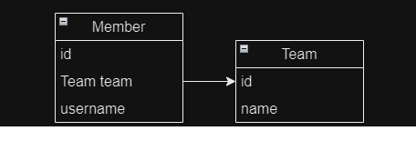
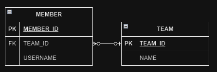
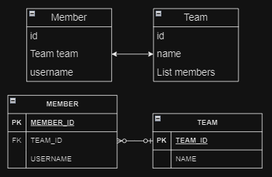

# 연관관계 매핑
#### 목차
1. [단방향 연관관계](#단방향-연관관계)
    - [객체 관계 매핑](#객체-관계-매핑)
    - [연관관계 매핑 어노테이션](#연관관계-매핑-어노테이션)
        - [@JoinColumn](#joincolumn)
2. [양방향 연관관계](#양방향-연관관계)
3. [양방향 매핑의 규칙: 연관관계의 주인](#양방향-매핑의-규칙-연관관계의-주인)
5. [양방향 연관관계 저장](#양방향-연관관계-저장)
6. [양방향 연관관계의 주의점](#양방향-연관관계의-주의점)

----
## 단방향 연관관계
#### 📌 다대일(N:1) 단방향 관계
- 회원과 팀이 있다.
- 회원은 하나의 팀에만 소속될 수 있다.
- 회원과 팀은 다대일 관계다.

<br>

#### 👉 객체 연관관계



- 회원 객체는 `Member.team` 필드(멤버변수)로 팀 객체와 연관관계를 맺는다.
- 회원 객체와 팀 객체는 단방향 관계이다.
    - 회원은 `Member.team` 필드를 통해 팀을 알 수 있지만, 반대로 팀은 회원을 알 수 없다.
    - member → team 조회는 `member.getTeam()`으로 가능하지만 반대로 접근하는 필드는 존재하지 않는다.

#### 👉 테이블 연관관계



- `MEMBER` 테이블은 `TEAM_ID` 외래 키로 `TEAM` 테이블과 연관관계를 가진다.
- `MEMBER` 테이블과 `TEAM` 테이블은 양방향 관계이다.
    - 회원과 팀을 조인하는 SQL
        ```sql
        SELECT *
        FROM MEMBER M
        JOIN TEAM T ON M.TEAM_ID = T.ID
        ```
    - 팀과 회원을 조인하는 SQL
        ```sql
        SELECT *
        FROM TEAM T
        JOIN MEMBER M ON T.TEAM_ID = M.TEAM_ID
        ```

#### 📌 객체 연관관계와 테이블 연관관계의 가장 큰 차이
- 참조를 통한 연관관계는 항상 단방향이다.

    <strong>👉 양방향 연관관계</strong>
    
    객체간 연관관계를 양방향으로 설정하려면 반대 쪽에도 필드를 추가해 참조를 보관해야 한다. 
    
    즉, 연관관계를 하나 더 만들어야 한다.

    결과적으로, 객체간 양방향 관계는 서로 다른 두 연관관계가 서로를 참조하여 양방향 관계를 이룬다.

- 테이블을 외래키를 사용하여 외래 키 하나로 양방향 조인이 가능하다.

<strong>✨ 단방향 연관관계</strong>

- A → B(a.b)

```java
Class A {
    B b;
}
Class B {}
```

<strong>✨ 양방향 연관관계</strong>

- A → B(a.b)
- B → A(b.a)

```java
Class A {
    B b;
}

Class B {
    A a;
}
```

### 객체 관계 매핑
Member 클래스와 Team 클래스를 JPA를 사용하여 매핑하는 방법은 다음과 같다.

```java
@Entity
public Class Member {
    @Id
    @Column(name = "MEMBER_ID")
    private String id;

    private String username;

    // 연관관계 매핑
    @ManyToOne
    @JoinColumn(name = "TEAM_ID")
    private Team team;

    // 연관관계 설정
    public void setTeam(Team team) {
        this.team = team;
    }

    // Getter, Setter ...
}
```
```java
@Entity
public Class Team {
    @Id
    @Column(name = "TEAM_ID")
    private String id;

    private String name;

    //Getter, Setter ...
}
```

### 연관관계 매핑 어노테이션
#### @JoinColumn
`@JoinColumn`은 외래 키를 매핑할 때 사용한다.

|속성|기능|기본값|
|--|--|--|
|name|매핑할 외래 키 이름|필드명 + _ + 참조하는 테이블의 기본 키 컬럼 명|
|referencedColumnName|외래 키가 참조하는 대상 테이블의 컬럼명|참조하는 테이블의 기본 키 컬럼명|
|foreignKey(DDL)|외래 키 제약조건을 직접 지정할 수 있다.<br>해당 속성은 테이블을 생성할 때만 사용한다.|
|unique<br>nullable<br>insertable<br>updatable<br>columnDefinition<br>table|@Column의 속성과 같다.||

> 📌`@JoinColumn`을 생략하면 외래 키를 찾을 때 기본 전략을 사용한다.

#### @ManyToOne
`@ManyToOne`은 다대일 관계에서 사용된다.

|속성|기능|기본값|
|--|--|--|
|optional|false로 설정하면 연관된 엔티티가 항상 있어야 한다.|true|
|fetch|글로벌 패치 전략을 설정한다.|👉@ManyToOne=FetchType.EAGER<br>👉@OneToMany=FetchType.LAZY|
|cascade|영속성 전이 기능을 사용한다.|
|targetEntity|연관된 엔티티의 타입 정보를 설정한다.<br>❗잘 사용하지 않는다.||

## 양방향 연관관계


### 양방향 연관관계 매핑
```java
@Entity
public Class Member {
    @Id
    @Column(name = "MEMBER_ID")
    private String id;

    private String username;

    // 연관관계 매핑
    @ManyToOne
    @JoinColumn(name = "TEAM_ID")
    private Team team;

    // 연관관계 설정
    public void setTeam(Team team) {
        this.team = team;
    }

    // Getter, Setter ...
}
```
```java
@Entity
public class Team {
    @Id
    @Column(name = "TEAM_ID")
    private String id;

    private String name;

    // 추가
    @OneToMany(mappedBy = "team")
    private List<Member> members = new ArrayList<Member>();

    // Getter, Setter ...
}
```

## 양방향 매핑의 규칙: 연관관계의 주인
객체는 두 개의 객체 참조를 통해 양방향 매핑을 구성하게 된다.

하지만, 양방향 매핑에서 외래 키는 단 하나 존재한다.

때문에 두 개의 객체 참조 중에서 어떤 참조에서 외래 키를 관리해야 할까?

JPA에서는 두 객체 연관관계 중 하나를 정해 테이블의 외래 키를 관리해야 한다.

이를 `연관관계의 주인`이라고 한다.

### 연관관계의 주인
연관관계의 주인은 데이터베이스 연관관계와 매핑되고 외래 키를 관리할 수 있다.

주인이 아닌 쪽은 읽기만 가능하다.

#### mappedBy
`mappedBy` 속성을 통해 연관관계의 주인을 설정할 수 있다.

```java
@OneToMany(mappedBy = "team")
private List<Member> members = new ArrayList<Member>();
```

- 주인은 `mappedBy`를 사용하지 않는다.
- 주인이 아니면 `mappedBy` 속성을 사용하여 속성의 값으로 연관관계의 주인을 지정해야 한다.

#### 연관관계의 주인을 결정하는 방법
`Member.team`과 `Team.members` 중 어떤 것을 연관관계의 주인으로 결정해야 할까?

- 회원 → 팀(Member.team 뱡향)
    ```java
    Class Member {
        @ManyToOne
        @JoinColumn(name = "TEAM_ID")
        private Team team;
        ...
    }
    ```
- 팀 → 회원(Team.members 방향)
    ```java
    Class Team {
        @OneToMany
        private List<Member> members = new ArrayList<>();
        ...
    }
    ```

연관관계의 주인은 테이블에 외래 키가 있는 곳으로 정해야 한다.


위 테이블 구조를 보면 `MEMBER`에 외래 키를 가지고 있기 때문에 `Member.team`을 연관관계의 주인이 된다.

## 양방향 연관관계 저장
```java
public void testSave() {
    // 팀 1 저장
    Team team1 = new Team("team1", "팀1");
    em.persist(team1);

    // 회원 1 저장
    Member member1 = new Member("member1", "회원1");
    member1.setTeam(team1);     // 연관관계 설정, member1 → team1
    em.persist(member1);

    // 회원 2 저장
    Member member2 = new Member("member2", "회원2");
    member2.setTeam(team1);     // 연관관계 설정, member2 → team1
    em.persist(member2);
}
```

|MEMBER_ID|USERNAME|TEAM_ID|
|--|--|--|
|member1|회원1|team1|
|member2|회원2|team2|

`TEAM_ID`에 팀의 기본 키 값이 저장되어 있는데, 이는 양방향 연관관계에서 연관관계의 주인이 외래 키를 관리하기 때문이다.

때문에 주인이 아닌 방향은 값을 입력하지 않아도 자동으로 데이터베이스에 외래 키 값이 입력된다.

```java
// 무시(연관관계의 주인이 아님)
team1.getMembers().add(member1);
team1.getMembers().add(member2);
```

## 양방향 연관관계의 주의점
### ❗ 연관관계의 주인에는 값을 입력하지 않고, 주인이 아닌 곳에만 입력하는 것
데이터베이스에 외래 키 값이 정상적으로 저장되지 않으면 다음 경우를 의심해 봐야 한다.
```java
public void testSaveNonOwner() {
    // 회원 1 저장
    Member member1 = new Member("member1", "회원1");
    em.persist(member1);

    // 회원 2 저장
    Member member2 = new Member("member2", "회원2");
    em.persist(member2);

    Team team1 = new Team("team1", "팀1");
    // 주인이 아닌 곳만 연관관계 설정
    team1.getMembers().add(member1);
    team1.getMembers().add(member2);

    em.persist(team1);
}
```
|MEMBER_ID|USERNAME|TEAM_ID|
|--|--|--|
|member1|회원1|null|
|member2|회원2|null|

외래 키인 `TEAM_ID`에 `null` 값이 저장되어 있는데, 이는 연관관계의 주인이 아닌 곳에만 `Team.members`를 저장했기 떄문이다.

외래 키 관리는 연관관계의 주인만 할 수 있는 것이기 때문에, 연관관계의 주인이 아닌 곳에서만 입력한다면 외래 키의 값이 정상적으로 적용되지 않는다.

#### 📌 순수한 객체까지 고려한 양방향 연관관계
객체의 관점에서 양쪽 방향에 모두 값을 입력해주는 것이 가장 안전하다.

```java
public void test() {
    // 팀 1
    Team team1 = new Team("team1", "팀1");
    em.persist(team1);

    Member member1 = new Member("member1", "회원1");
    member1.setTeam(team1);             // 연관관계 설정 member1 → team1
    team1.getMembers().add(member1);    // 연관관계 설정 team1 → member1
    em.persist(member1);

    Member member2 = new Member("member2", "회원2");
    member2.setTeam(team1);             // 연관관계 설정 member2 → team1
    team1.getMembers().add(member2);    // 연관관계 설정 team1 → member2
    em.persist(member2);
}
```

-----
## 💎 References
- [자바 ORM 표준 JPA 프로그래밍](https://product.kyobobook.co.kr/detail/S000000935744)