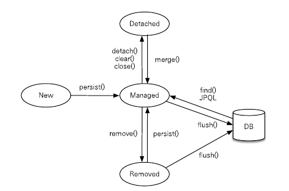

## 영속성 관리
### 목차
1. [영속성 컨텍스트란?](#영속성-컨텍스트란)
2. [엔티티의 생명주기](#엔티티의-생명주기) 
    - [비영속](#비영속)
    - [영속](#영속)
    - [준영속](#준영속)
    - [삭제](#삭제)
3. [영속성 컨텍스트의 특징](#영속성-컨텍스트의-특징)
    - [엔티티 조회](#엔티티-조회)
    - [엔티티 수정](#엔티티-수정)
    - [엔티티 등록](#엔티티-등록)
    - [엔티티 삭제](#엔티티-삭제)
4. [플러시](#플러시)
    - [영속성 컨텍스트를 플러시하는 방법](#영속성-컨텍스트를-플러시하는-방법)
5. [준영속](#eca480ec9881ec868d-1)
    - [영속 상태의 엔티티를 준 영속 상태로 만드는 방법](#영속-상태의-엔티티를-준-영속-상태로-만드는-방법)
    - [준영속 상태의 특징](#준영속-상태의-특징)

---
## 영속성 컨텍스트란?
> 엔티티를 영구 저장하는 환경

엔티티 매니저로 엔티티를 저장하거나 조회하게 되면, 엔티티 매니저는 영속성 컨텍스트에 엔티티를 보관하고 관리한다.

```java
em.persist(member);
```
위 `persist` 메서드는 엔티티 매니저를 사용하여 `member` 엔티티를 영속성 컨텍스트에 저장하는 역할을 한다.

## 엔티티의 생명주기
엔티티의 생명주기는 아래 4가지 상태가 존재한다.

- `비영속(new/transient)`: 영속성 컨텍스트와 전혀 관련이 없는 상태
- `영속(managed)`: 영속성 컨텍스트에 저장된 상태
- `준영속(detached)`: 영속성 컨텍스트에 저장되었다가 분리된 상태
- `삭제(removed)`: 삭제된 상태



### 비영속
엔티티 객체를 생성하면 해당 객체는 비영속 상태이다.

```java
Member member = new Member();

member.setId("member 1");
member.setUserName("회원 1");
```

아직 객체를 생성만 하고 저장하지 않았기 때문에 영속성 컨텍스트와 데이터베이스와 아무런 연관이 없다.

### 영속
`persist`를 사용하여 객체를 저장하면, 해당 객체는 영속 상태가 된다.

즉, 엔티티 매니저를 통해 엔티티를 영속성 컨텍스트에 저장되어 객체를 영속 상태로 만든 것이다.

```java
em.persist(member);
```

위 `member` 객체는 영속 상태가 되었기 때문에 영속성 컨텍스트에 의해 관리된다.

`persist` 뿐만 아니라 `em.find()`나 `JPQL`을 사용해 조회한 엔티티도 영속 상태가 된다.

### 준영속
영속 상태에서 영속성 컨텍스트에 의해 관리되던 엔티티가 더이상 영속성 컨텍스트에 의해 관리되지 않게 되면 이 엔티티를 준영속 상태라고 한다.

```java
em.detach(member);
```

엔티티를 준영속 상태로 만들기 위해서는 `detach`를 사용하면 된다.

또한 `em.close()`나 `em.clear()`를 사용하여 영속성 컨텍스트를 초기화해도 엔티티가 준영속 상태가 된다.

### 삭제
엔티티를 영속성 컨텍스트와 데이터베이스에서 삭제한다.

```java
em.remove(member);
```

## 영속성 컨텍스트의 특징
- 1차 캐시
- 동일성 보장
- 트랜잭션을 지원하는 쓰기 지연
- 변경 감지
- 지연 로딩

### 엔티티 조회
#### ✨ 1차 캐시
영속성 컨텍스트는 내부에 `1차 캐시`를 가지고 있으며, 1차 캐시에는 모든 영속 상태의 엔티티가 저장된다.

즉, 영속성 컨텍스트 내부에 키가 `@Id로 매핑한 식별자`이고 값이 엔티티 인스턴스인 Map이 존재하는 것이다.

```java
// 비영속 상태
Member member = new Member();
member.setId("member1");
member.setUserName("회원 1");

// 영속 상태
member.persist(member);
```

엔티티를 영속 상태로 만들면 다음과 같이 `1차 캐시`에 해당 엔티티를 저장한다.

|@Id|Entity|
|--|--|
|"member1"|member|

#### 👉 em.find() 메서드
영속성 컨텍스트에 데이터를 저장하고 조회하는 모든 기준은 데이터베이스의 기본 키 값이다.
```java
Member member = em.find(Member.class, "member1");
```

엔티티를 조회할 때 사용하는 `find` 메서드를 살펴보면 다음과 같다.

```java
//EntityManager.find()
public <T> find(Class<T> entityClass, Object primaryKey);
```

`em.find()`를 호출하면 먼저 `1차 캐시`에서 엔티티를 찾고, 찾는 엔티티가 `1차 캐시`에 존재하지 않으면 데이터베이스에서 조회한다.

#### ❗ 1차 캐시에서 엔티티 조회
위에서 서술한 것처럼 `em.find()`을 호출하면 먼저 `1차 캐시`에서 엔티티를 찾게 된다.

```java
Member member = new Member();
member.setId("member1");
member.setUsername("회원1");

// 1차 캐시에 저장
em.persist(member);

// 1차 캐시에서 조회
Member findMember = em.find(Member.class, "member1");
```

위 코드는 `1차 캐시`에 저장된 엔티티를 찾는 코드이다.

기본 키 `member1`을 통해 엔티티를 찾는다.

#### ❗ 데이터베이스에서 엔티티 조회
만약 찾는 엔티티가 `1차 캐시`에 존재하지 않으면 `데이터베이스`에서 해당 엔티티를 조회해 엔티티를 생성한다.

이후 `1차 캐시`에 저장한 후 영속 상태의 엔티티를 반환한다.

#### ✨ 영속 엔티티의 동일성 보장
식별자가 같은 엔티티를 조회하면 이 엔티티들은 동일할까?
```java
Member a = em.find(Member.class, "member1");
Member b = em.find(Member.class, "member1");

System.out.println(a == b);     // true
```

`a`와 `b` 두 엔티티 모두 `1차 캐시`에 존재하는 엔티티 인스턴스를 반환하기 때문에 두 엔티티는 같은 엔티티이다.

따라서 영속성 컨텍스트는 성능상의 이점과 엔티티의 동일성을 보장한다.

### 엔티티 등록
#### ✨ 쓰기 지연

```java
EntityManager em = emf.createEntityManager();
EntityTransaction transaction = em.getTransaction();

// 엔티티 매니저는 데이터 변경 시 트랜잭션을 시작한다.
transaction.begin();

em.persist(memberA);
em.persist(mamberB);

// 커밋하는 순간 데이터베이스에 INSERT SQL을 보낸다.
transaction.commit();
```
위 코드를 보면 `persist`를 통해 `INSERT SQL`을 생성하고, `transaction.commit()`을 통해 데이터베이스에 `persist`를 통해 생성된 `INSERT SQL`을 보낸다.

즉, `쓰기 지연`은 엔티티 매니저가 트랜잭션을 커밋하기 직전까지 데이터베이스에 엔티티를 저장하지 않고 내부 쿼리 저장소에 `INSERT SQL`을 모아두고, 트랜잭션을 커밋할 때 모아둔 `INSERT SQL`을 보내는 것을 말한다.

> 📌 [JPA란?](https://github.com/sieunp06/TIL/blob/main/Spring/Spring%20JPA/What-is-Spring-JPA.md)

### 엔티티 수정
#### ❗ SQL 수정 쿼리의 문제점
`SQL`에서 수정 쿼리를 사용할 때, 프로젝트의 규모가 점점 커지게 되면 수정 쿼리가 점점 길어지게 된다.

```sql
UPDATE MEMBER
SET
    NAME=?,
    AGE=?
WHERE
    id=?
```

위 쿼리는 회원의 이름과 나이를 변경하는 SQL이다.

만약 회원의 등급을 변경하는 기능이 추가되면 위 수정 쿼리가 더 길어진다.

```sql
UPDATE MEMBER
SET
    NAME=?,
    AGE=?,
    GRADE=?
WHERE
    id=?
```


#### ✨ 변경 감지
```java
EntityManager  em = emf.createEntityManager();
EntityTransaction transaction = em.getTransaction();
transaction.begin();

// 영속 엔티티 조회
Member mamberA = em.find(Member.class, "memberA");

// 영속 엔티티 수정
memberA.setUsername("hi");
memberA.setAge(10);

// 트랜잭션 커밋
transaction.commit();
```

위 코드는 `JPA`에서 엔티티를 수정하는 코드이다.

하지만 엔티티 수정에 대한 메서드가 없다.

이렇게 엔티티의 데이터를 변경했을 때, 엔티티의 변경사항을 데이터베이스에 자동으로 반영하는 기능을 `변경 감지`라고 한다.

#### ❗ 스냅샷
`JPA`는 엔티티를 영속성 컨텍스트에 보관할 때, 최초 상태를 복사해서 저장해두는 것을 `스냅샷`이라고 한다.

이후 플러시 시점에 스냅샷과 엔티티를 비교해 변경된 엔티티를 찾는다.

1. 트랜잭션을 커밋하면 엔티티 매니저 내부에서 먼저 플러시(flush())가 호출된다.
2. 엔티티와 스냅샷을 비교해서 변경된 엔티티를 찾는다.
3. 변경된 엔티티가 있으면 수정 쿼리를 생성해 쓰기 지연 SQL 저장소에 보낸다.
4. 쓰기 지연 저장소의 SQL을 데이터베이스에 보낸다.
5. 데이터베이스 트랜잭션을 커밋한다.

<br>

이때 `변경 감지`는 영속성 컨텍스트가 관리하는 영속 상태의 엔티티에만 적용된다.

#### ❗ 변경 감지 - JPA의 기본 전략
```java
EntityManager  em = emf.createEntityManager();
EntityTransaction transaction = em.getTransaction();
transaction.begin();

// 영속 엔티티 조회
Member mamberA = em.find(Member.class, "memberA");

// 영속 엔티티 수정
memberA.setUsername("hi");
memberA.setAge(10);

// 트랜잭션 커밋
transaction.commit();
```

위 코드를 통해 엔티티를 수정하게 되면 아래처럼 `NAME`과 `AGE`만 변경하는 `UPDATE SQL`을 생성할 것으로 보인다.

```sql
UPDATE MEMBER
SET
    NAME=?,
    AGE=?
WHERE
    id=?
```

하지만 `JPA`는 아래처럼 엔티티의 모든 필드를 업데이트한다.
```sql
UPDATE MEMBER
SET
    NAME=?,
    AGE=?,
    GRADE=?,
    ...
WHERE
    id=?
```

위와 같은 `JPA`의 기본 방식은 다음과 같은 장점이 있다.

1. 모든 필드를 사용하면 수정 쿼리가 항상 같다.
    - 때문에 애플리케이션 로딩 시점에 수정 쿼리를 미리 생성해두고 재사용할 수 있다.
2. 데이터베이스에 동일한 쿼리를 보내면 데이터베이스는 이전에 한 번 파싱된 쿼리를 재사용할 수 있다.

### 엔티티 삭제
#### ✨ 지연 로딩
엔티티를 삭제하기 위해서는 삭제 대상 엔티티를 조회해야 한다.

```java
Member memberA = em.find(Member.class, "memberA");
em.remove(memberA);
```

이때, 삭제 쿼리를 쓰기 지연 SQL 저장소에 등록한 후, 트랜잭션을 커밋해 플러시를 호출하여 데이터베이스에 삭제 쿼리를 전달한다.

이때 영속성 컨텍스트에서 제거된다.

## 플러시
> 영속성 컨텍스트의 변경 내용을 데이터베이스에 반영한다.

1. 변경 감지가 동작해서 영속성 컨텍스트에 있는 모든 엔티티를 스냅샷과 비교하여 수정된 엔티티를 찾는다. 수정된 엔티티는 수정 쿼리를 만들어 쓰기 지연 SQL 저장소에 등록한다.
2. 쓰기 지연 SQL 저장소의 쿼리를 데이터베이스에 전송한다.

### 영속성 컨텍스트를 플러시하는 방법
1. `em.flush()`를 직접 호출
2. 트랜잭션 커밋
3. JPQL 쿼리 실행

#### ✨ `em.flush()`를 직접 호출
`em.flush()`를 호출하여 영속성 컨텍스트를 강제로 플러시한다.

테스트나 다른 프레임워크와 JPA를 같이 사용할 때를 제외하고 거의 사용하지 않는다.

#### ✨ 트랜잭션 커밋
데이터베이스에 변경 내용을 SQL로 전달하지 않고 트랜잭션만 커밋하면 아무 것도 반영되지 않는다.

때문에 트랜잭션을 커밋하기 전에 플러시를 호출하고 영속성 컨텍스트의 변경 내용을 데이터베이스에 반영한다.

#### ✨ JPQL 쿼리 실행
```java
em.persist(memberA);
em.persist(memberB);
em.persist(memberC);

// JPQL
query = em.createQuery("select m from Member m", Member.class);
List<Member> members = query.getResultList();
```

`JPQL`을 사용하여 쿼리를 실행하기 직전에 영속성 컨텍스트를 플러시하여 데이터베이스에 반영해야 한다.

### 플러시 모드 옵션
- FlushModeType.AUTO: 커밋이나 쿼리를 실행할 때 플러시(default)
- FlushModeType.COMMIT: 커밋할 때만 플러시

## 준영속
> 영속성 컨텍스트가 돤리하는 영속 상태의 엔티티가 영속성 컨텍스트에서 분리된 것

준영속 상태의 엔티티는 영속성 컨텍스트가 제공하는 기능을 사용할 수 없다.

### 영속 상태의 엔티티를 준 영속 상태로 만드는 방법
1. `em.detach(entity)`: 특정 엔티티만 준영속 상태로 전환한다.
2. `em.clear()`: 영속성 컨텍스트를 완전히 초기화한다.
3. `em.close()`: 영속성 컨텍스트를 종료한다.

#### 📌 `em.detach(entity)`
`em.detach(entity)`는 특정 엔티티를 준영속 상태로 만든다.

```java
public void testDetached() {
    ...

    // 회원 엔티티 생성, 비영속 상태
    Member member = new Member();
    member.setId("memberA");
    member.setUsername("회원A");

    // 영속 상태
    em.persist(member);

    // 준영속 상태
    em.detach(member);

    transaction.commit();
}
```

`detach`를 호출하면 1차 캐시부터 쓰기 지연 SQL 저장소까지 해당 엔티티를 관리하기 위한 모든 정보가 제거된다.

#### 📌 `em.clear()`
`em.clear()`는 영속성 컨텍스트를 초기화하여 해당 영속성 컨텍스트의 모든 엔티티를 준영속 상태로 만든다.

```java
Member member = em.find(Member.class, "memberA");

em.clear();     // 영속성 컨텍스트 초기화

member.setUsername("changeName");
```

위 코드에서는 `em.clear()`를 통해 영속성 컨텍스트를 초기화하여 `member` 엔티티를 준영속 상태로 만들었기 때문에 `setUsername`은 적용되지 않는다.

#### 📌 `em.close()`
`em.close()`는 영속성 컨텍스트를 종료하여 영속성 컨텍스트가 관리하던 영속 상태의 엔티티를 준영속 상태로 만든다.

### 준영속 상태의 특징
1. 거의 비영속 상태에 가깝다.
2. 식별자 값을 가지고 있다.
3. 지연 로딩을 할 수 없다.

#### ✨ 거의 비영속 상태에 가깝다.
영속성 컨텍스트가 관리하지 않기 때문에 1차 캐시, 쓰기 지연, 변경 감지, 지연 로딩을 포함한 영속성 컨텍스트가 제공하는 어떠한 기능도 동작하지 않는다.

#### ✨ 식별자 값을 가지고 있다.
준영속 상태의 엔티티는 준영속 상태가 되기 전 영속 상태였기 때문에 식별자 값을 가지고 있다.

#### ✨ 지연 로딩을 할 수 없다.
준영속 상태는 영속성 컨텍스트가 더는 관리하지 않기 떄문에 지연 로딩 시 문제가 발생한다.
