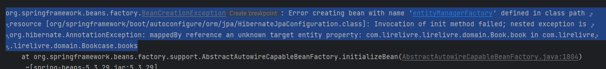
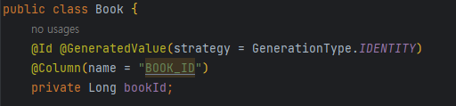
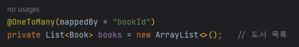

# Spring JPA “mappedBy reference an unknown target entity property” 해결
## 🐛ISSUE

> mappedBy reference an unknown target entity property: com.lirelivre.lirelivre.domain.Book.book in com.lirelivre.lirelivre.domain.Bookcase.books

`Bookcase.books`와 `Book.book` 사이의 조인 매핑에 에러가 발생하고 있었다.

## ❗CAUSE

두 번째 사진의 `@OneToMany`에서 `mappedBy` 속성을 통해 연관관계의 주인을 설정할 때, 필드명을 `bookId`로 만들고 `mappedBy`에서 `book`으로 작성했기 때문에 발생한 문제이다.

## ✨SOLUTIONS

`@OneToMany`의 `mappedBy` 속성 값을 필드명인 `bookId`로 일치시켜 해결하였다.