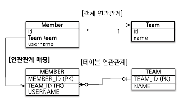
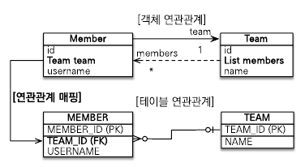
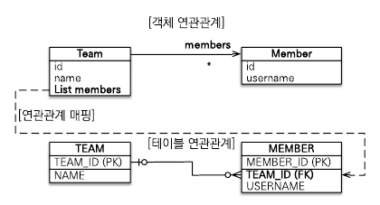
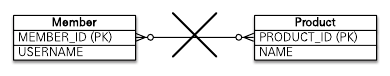
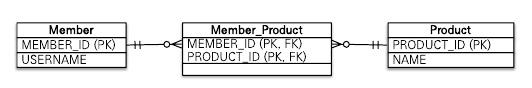
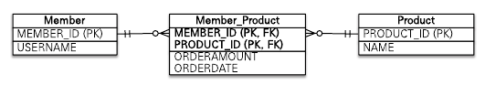
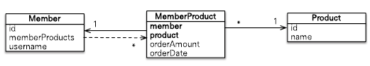
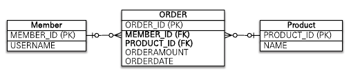

# 다양한 연관관계 매핑
### 목차
1. [다대일](#다대일)
    - [다대일 단방향(N:1)](#다대일-단방향n1)
    - [다대일 양방향(N:1, 1:N)](#다대일-양방향n1-1n)
2. [일대다](#일대다)
    - [일대다 단방향(1:N)](#일대다-단방향1n)
        - [📌일대다 단방향 매핑의 단점](#📌일대다-단방향-매핑의-단점)
    - [일대다 양방향(1:N, N:1)](#일대다-양방향1n-n1)
3. [일대일(1:1)](#일대일11)
    - [주 테이블에 외래 키](#주-테이블에-외래-키)
    - [대상 테이블에 외래 키](#대상-테이블에-외래-키)
4. [다대다(N:N)](#다대다nn)
    - [다대다: 매핑의 한계와 극복, 연결 엔티티 사용](#다대다-매핑의-한계와-극복-연결-엔티티-사용)
        - [📌 복합 기본 키](#📌-복합-기본-키)
    - [다대다: 새로운 기본 키 사용](#다대다-새로운-기본-키-사용)

----
## 다대일
### 다대일 단방향(N:1)


```java
@Entity
public class Member {
    @Id @GeneratedValue
    @Column(name = "MEMBER_ID")
    private Long id;

    private String username;

    @ManyToOne
    @JoinColumn(name = "TEAM_ID")
    private Team team;

    ...
}
```

```java
@Entity
public class Team {
    @Id @GeneratedValue
    @Column(name = "TEAM_ID")
    private Long id;

    private String name;

    ...
}
```

`Member` 클래스에서는 `Member.team`으로 `Team`을 조회할 수 있지만, 반대로 `Team`에서 `Member`를 조회할 수 없다.

```java
@ManyToOne
@JoinColumn(name = "TEAM_ID")
private Team team;
```

`@JoinColumn`을 통해 `Member.team`을 `TEAM_ID` 외래 키와 매핑했다. 

### 다대일 양방향(N:1, 1:N)


```java
@Entity
public class Member {
    @Id @GeneratedValue
    @Column(name = "MEMBER_ID")
    private Long id;

    private String username;

    @ManyToOne
    @JoinColumn(name = "TEAM_ID")
    private Team team;

    public void setTeam(Team team) {
        this.team = team;

        // 무한루프에 빠지지 않도록 체크
        if (!team.getMembers().contains(this)) {
            team.getMembers().add(this);
        }
    }
}
```

```java
@Entity
public class Team {
    @Id @GeneratedValue
    @Column(name = "TEAM_ID")
    private Long id;

    private String name;

    @OneToMany(mappedBy = "team")
    private List<Member> members = new ArrayList<>();

    public void addMember(Member member) {
        this.members.add(member);

        // 무한루프에 빠지지 않도록 체크
        if (member.getTeam() != this) {
            member.setTeam(this);
        }
    }
}
```

- 양방향은 외래 키가 있는 쪽이 연관관계의 주인이다.
- 양방향 연관관계는 항상 서로를 참조해야 한다.

## 일대다
일대다 관계는 다대일 관계의 반대이다.

엔티티를 하나 이상 참조할 수 있기 떄문에 `Collection`, `List`, `Set`, `Map` 중 하나를 사용해야 한다.

### 일대다 단방향(1:N)
하나의 팀은 여러 회원을 참조할 수 있기 때문에 일대다 관계를 가지고 있다.



```java
@Entity
public class Team {
    @Id @GeneratedValue
    @Column(name = "TEAM_ID")
    private Long id;

    private String name;

    @OneToMany
    @JoinColumn(name = "TEAM_ID")   // Member 테이블의 TEAM_ID (FK)
    private List<Member> members = new ArrayList<>();

    ...
}
```
```java
@Entity
public class Member {
    @Id @GeneratedValue
    @Column(name = "MEMBER_ID")
    private Long id;

    private String username;

    ...
}
```

#### 📌일대다 단방향 매핑의 단점
일대다 단방향 매핑의 단점은 매핑한 객체가 관리하는 외래 키가 다른 테이블에 있다는 것이다.

다른 테이블에 외래 키가 있으면 엔티티의 저장과 연관관계 처리를 `INSERT SQL` 한 번 외에 `UPDATE SQL`이 추가로 실행해야 한다.

```java
public void testSave() {
    Member member1 = new Member("member1");
    Member member2 = new Member("member2");

    Team team1 = new Team("team1");
    team1.getMembers().add(member1);
    team1.getMembers().add(member2);

    em.persist(member1);    // INSERT-member1
    em.persist(member2);    // INSERT-member1
    em.persist(team1);      // INSERT-team1, UPDATE-member1.fk, UPDATE-member2.fk

    transaction.commit();
}
```

> 👉 일대다 단방향 매핑보다 다대일 양방향 매핑을 이용하자

### 일대다 양방향(1:N, N:1)
일대다 양방향은 존재하지 않으며, 대신 다대일 양방향 매핑을 사용한다.

다대일 양방향 매핑에서 `@OneToMany`는 연관관계의 주인이 될 수 없지만, 방법이 없는 것은 아니다.

```java
@Entity
public class Team {
    @Id @GeneratedValue
    @Column(name = "TEAM_ID")
    private Long id;

    private String name;

    @OneToMany
    @JoinColumn(name = "TEAM_ID")
    private List<Member> members = new ArrayList<>();

    ...
}
```
```java
@Entity
public class Member {
    @Id @GeneratedValue
    @Column(name = "MEMBER_ID")
    private Long id;

    private String username;

    @ManyToOne
    @JoinColumn(name = "TEAM_ID", insertable = false, updatable = false)
    private Team team;

    ...
}
```
일대다 단방향 매핑 반대편에 같은 외래 키를 사용하는 다대일 단방향 매핑을 읽기 전용으로 변경한다.

```java
@ManyToOne
@JoinColumn(name = "TEAM_ID", insertable = false, updatable = false)
private Team team;
```

## 일대일(1:1)
일대일 관계는 서로 하나의 관계만 가진다.

- 일대일 관계는 그 반대도 일대일 관계다.
- 일대일 관계는 주 테이블이나 대상 테이블 둘 중 어느 곳이나 외래 키를 가질 수 있다.

주 테이블과 대상 테이블 중 어떤 쪽이 외래 키를 가져야 할까?

- MEMBER(회원): 주 테이블
- LOCKER(사물함): 대상 테이블

### 주 테이블에 외래 키
객체지향 개발자들이 선호하는 방법이다.

주 테이블에 외래 키를 가지고 있기 떄문에 주 테이블만 확인해도 대상 테이블과 연관관계가 있는지 알 수 있다.

#### 📌 단방향
```java
@Entity
public class Member { 
    @Id @GeneratedValue
    @Column(name = "MEMBER_ID")
    private Long id;

    private String username;

    @OneToOne
    @JoinColumn(name = "LOCKER_ID")
    private Locker locker;

    ...
}
```
```java
@Entity
public class Locker {
    @Id @GeneratedValue
    @Column(name = "LOCKER_ID")
    private Long id;

    private String name;

    ...
}
```

#### 📌 양방향
```java
@Entity
public class Member { 
    @Id @GeneratedValue
    @Column(name = "MEMBER_ID")
    private Long id;

    private String username;

    @OneToOne
    @JoinColumn(name = "LOCKER_ID")
    private Locker locker;

    ...
}
```
```java
@Entity
public class Locker {
    @Id @GeneratedValue
    @Column(name = "LOCKER_ID")
    private Long id;

    private String name;

    @OneToOne(mappedBy = "locker")
    private Member member;

    ...
}
```
양방향이기 떄문에 연관관계의 주인을 정해야 한다.

이때 `MEMBER` 테이블에서 외래 키를 가지고 있기 떄문에 `Member` 엔티티의 `Member.locker`가 연관관계의 주인이 된다.

### 대상 테이블에 외래 키
#### 📌 단방향
일대일 관계 중 대상 테이블에 외래 키가 있는 단방향 관계는 JPA에서 지원하지 않는다.

#### 📌 양방향
```java
@Entity
public class Member {
    @Id @GeneratedValue
    @Column(name = "MEMBER_ID")
    private Long id;

    private String username;

    @OneToOne(mappedBy = "member")
    private Locker locker;

    ...
}
```
```java
@Entity
public class Locker {
    @Id @GeneratedValue
    @Column(name = "LOCKER_ID")
    private Long id;

    private String name;

    @OneToOne
    @JoinColumn(name = "MEMBER_ID")
    private Member member;

    ...
}
```

## 다대다(N:N)
관계형 데이터베이스에서는 정규화된 테이블 2개로 다대다 관계를 표현할 수 없다.

그렇기 때문에 다대다 관계를 일대다, 다대일 관계로 풀어내는 연결 테이블을 사용한다.



`Member_Product`라는 연결 테이블을 추가했다.



추가된 `Member_Product`는 회원이 주문한 상품을 나타낸다.

하지만 객체에서는 두 개의 객체로 다대다 관계를 만들 수 있다.

### 📌 단방향
```java
@Entity
public class Member {
    @Id @Column(name = "MEMBER_ID")
    private Long id;

    private String username;

    @ManyToMany
    @JoinTable(name = "MEMBER_PRODUCT", joinColumns = @JoinColumn(name = "MEMBER_ID"), inverseJoinColumns = @JoinColumn(name = "PRODUCT_ID"))
    private List<Product> products = new ArrayList<>();

    ...
}
```
```java
@Entity
public class Product {
    @Id @Column(name = "PRODUCT_ID")
    private String id;

    private String name;

    ...
}
```

`@ManyToMany`와 `@JoinTable`를 통해 연결 테이블 엔티티를 따로 만들지 않고 매핑을 완료할 수 있다.


#### @JoinTable
- `@JoinTable.name` :연결 테이블을 지정한다.
- `@JoinTable.joinColumns`: 현재 방향인 회원과 매핑할 조인 컬럼 정보를 지정한다.
- `@JoinTable.inversJoinColumns`: 반대 방향인 상품과 매핑할 조인 컬러 정보를 지정한다.

### 📌 양방향
```java
@Entity
public class Product {
    @Id
    private String id;

    @ManyToMany(mappedBy = "products")  // 역방향 추가
    private String name;

    ...
}
```

### 다대다: 매핑의 한계와 극복, 연결 엔티티 사용
`@ManyToMany`를 사용하면 연결 테이블을 자동으로 처리해주기 때문에 편리하긴 하나, 실무에서 사용하기에 한계점이 존재한다.



예를 들어, 회원이 상품을 주문하면 연결 테이블에 단순히 회원 아이디와 상품 아이디만 담는 것이 아니라 주문 수량 컬럼이나 주문 날짜 같은 컬럼이 더 필요하다.

이렇게 컬럼을 추가하면 `@ManyToMany`를 사용할 수 없다.



위와 같이 연결 테이블인 `MemberProduct`를 만들고 이 테이블에 추가한 컬럼을 매핑해야 한다.

```java
@Entity
public class Member {
    @Id @Column(name = "MEMBER_ID")
    private String id;

    // 역방향
    @OneToMany(mappedBy = "member")
    private List<MemberProduct> memberProducts;

    ...
}
```

`MemberProduct`에서 외래 키를 가지고 있으므로 `Member.memberProducts`에서는 `mappedBy`를 사용하여 연관관계의 주인이 아님을 나타냈다.

```java
@Entity
public class Product {
    @Id @Column(name = "PRODUCT_ID")
    private String id;

    private String name;

    ...
}
```
`Product` 엔티티에서 `MemberProduct` 엔티티로 객체 그래프 탐색 기능이 필요하지 않다고 판단되어 연관관계를 만들지 않았다.

```java
@Entity
@IdClass(MemberProductId.class)
public class MemberProduct {
    @Id
    @ManyToMany
    @JoinColumn(name = "MEMBER_ID")
    private Member member;  // MemberProductId.member와 연결

    @Id
    @ManyToOne
    @JoinColumn(name = "PRODUCT_ID")
    private Product product;    // MemberProductId.product와 연결

    private int orderAmount;
}
```
`MemberProduct` 엔티티에서는 기본 키를 매핑하는 `@Id`와 외래 키를 매핑하는 `@JoinColumn`을 동시에 사용해서 기본 키 + 외래 키를 한번에 매핑했다.

`@IdClass`를 사용하여 복합 기본 키를 설정하였다.

```java
public class MemberProductId implements Serializable {
    private String member;  // MemberProduct.member와 연결
    private String product; // MemberProduct.product와 연결

    // hashCode and Equals
    @Override
    public boolean equals(Object o) {...}

    @Override
    public int hashCode() {...}
}
```

#### 📌 복합 기본 키
`MemberProduct` 엔티티는 기본 키가 `MEMBER_ID`와 `PRODUCT_ID`로 이루어진 복합 기본 키다.

JPA에서 복합 기본 키를 사용하려면 별도의 식별자 클래스를 만들어야 한다.

식별자 클래스는 `@IdClass`를 사용하려 지정할 수 있다.

<strong>👉 복합 키를 위한 식별자 클래스의 특징</strong>
- 복합 키는 별도의 식별자 클래스로 만들어야 한다.
- Serializable을 구현해야 한다.
- equals와 hashCode 메서드를 구현해야 한다.
- 기본 생성자가 있어야 한다.
- 식별자 클래스는 public이어야 한다.
- `@IdClass`를 사용하는 방법 외에 `@EmbeddedId`를 사용하는 방법도 있다.

### 다대다: 새로운 기본 키 사용
데이터베이스에서 자동으로 생성해주는 대리 키를 `Long`으로 사용하는 전략이다.

간편하고 거의 영구히 쓸 수 있으며, 비즈니스에 의존하지 않는다.



연결 테이블에 새로운 기본 키를 사용한다.

```java
@Entity
public class Order {
    @Id @GeneratedValue
    @Column(name = "ORDER_ID")
    private Long id;

    @ManyToOne
    @JoinColumn(name = "MEMBER_ID")
    private Member member;

    @ManyToOne
    @JoinColumn(name = "PRODUCT_ID")
    private Product product;

    private int orderAmount;

    ...
}
```

이 방법은 식별 관계에 복합 기본 키를 사용하는 것보다 매핑이 단순하고 이해하기 쉽다.

`Member` 엔티티와 `Product` 엔티티는 변경사항이 없다.

-----
## 💎 References
- [자바 ORM 표준 JPA 프로그래밍](https://product.kyobobook.co.kr/detail/S000000935744)